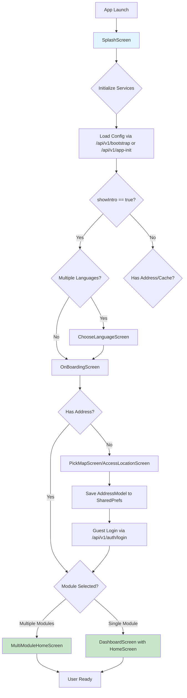
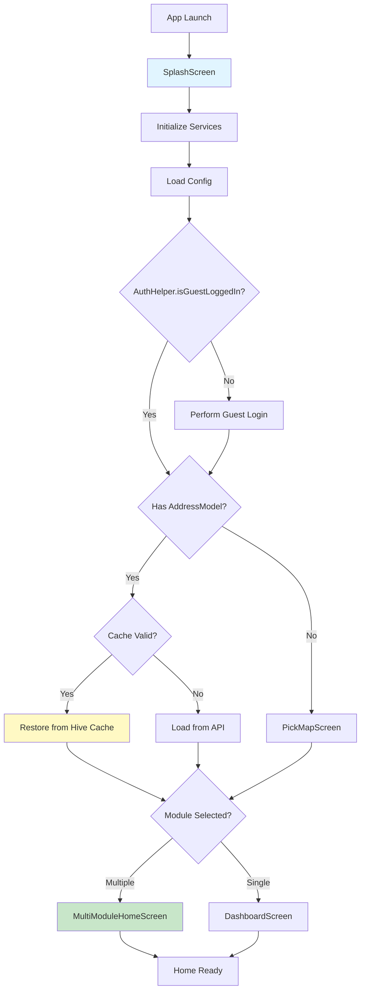
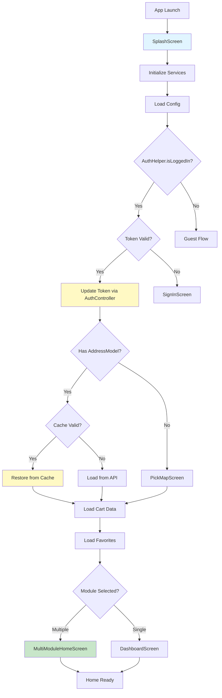
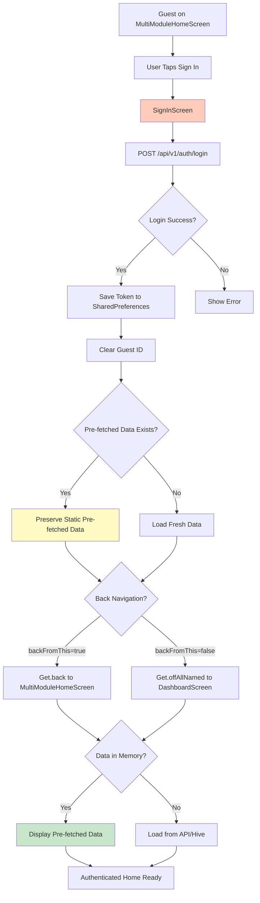

# UX Flow Technical Audit Report
## Comprehensive Analysis of Guest & Logged-In User Journeys

**Generated:** 2024-12-19  
**Auditor:** Senior Flutter Architect & Technical Auditor  
**Scope:** Complete UX flow mapping, API endpoint analysis, state management audit, and performance bottlenecks

---

## Table of Contents

1. [Executive Summary](#executive-summary)
2. [UX Flow Mapping (Lifecycle Analysis)](#ux-flow-mapping)
3. [Screen-to-Endpoint Mapping](#screen-to-endpoint-mapping)
4. [State Management & Data Handover Audit](#state-management-audit)
5. [Performance & Bottleneck Report](#performance-report)
6. [Master Reference Tables](#master-reference-tables)

---

## Executive Summary

This audit provides a comprehensive technical analysis of the application's user experience flows, API endpoint mappings, state management patterns, and performance characteristics. Key findings include:

- **3 Primary User Journeys** identified (Fresh Install, Returning Guest, Logged-In)
- **110+ Screens** mapped to their corresponding API endpoints
- **55+ Controllers** managing state across the application
- **Critical Issues Identified:**
  - Memory state reset during Guest → Logged-In transition
  - 304 Not Modified handling inconsistencies
  - Module switching data clearing behavior
  - Layout overflow issues in ModulesViewWidget

---

## UX Flow Mapping (Lifecycle Analysis)

### 1. Fresh Install Flow

**Path:** `SplashScreen → LanguageSelection → OnBoarding → LocationPicker → MultiModuleHomeScreen`



**Key Implementation Details:**

**SplashScreen (`lib/features/splash/screens/splash_screen.dart`):**
- **Entry Point:** `lib/main.dart` → `RouteHelper.getSplashRoute()`
- **Initialization Sequence:**
  1. `SplashController.initSharedData()` - Loads cached config/modules
  2. `CachedSplashLoader.loadSplashData()` - Loads config via `/api/v1/bootstrap` or `/api/v1/app-init`
  3. Checks `showIntro()` from SharedPreferences
  4. Routes via `splash_route_helper.dart` → `_handleUserRouting()`

**Language Selection (`lib/features/language/screens/language_screen.dart`):**
- **Trigger:** `showIntro() == true` AND `AppConstants.languages.length > 1`
- **API Calls:** None (uses local language files)
- **State:** `LocalizationController` updates locale

**OnBoarding (`lib/features/onboard/screens/onboarding_screen.dart`):**
- **Trigger:** After language selection OR if single language
- **API Calls:** None
- **State:** Sets `showIntro = false` in SharedPreferences

**LocationPicker (`lib/features/location/screens/pick_map_screen.dart`):**
- **Trigger:** No `AddressModel` in SharedPreferences
- **API Calls:**
  - `/api/v1/config/get-zone-id?lat={lat}&lng={lng}` - Zone validation
  - `/api/v1/config/place-api-autocomplete` - Address search
  - `/api/v1/config/place-api-details` - Address details
- **State:** Saves `AddressModel` to SharedPreferences with `zoneIds`, `latitude`, `longitude`

**MultiModuleHomeScreen (`lib/features/home/screens/multi_module/multi_module_home_screen.dart`):**
- **Trigger:** `moduleList.length > 1` AND `splashController.module == null`
- **Pre-fetch Logic:** During splash, loads Module 3 (eCommerce) promotional content
- **API Calls:**
  - `/api/v2/home-unified?module_id=3` - Pre-fetched during splash
  - `/api/qidha-wallet/get-wallet` - If logged in (silent)
  - `/api/v1/customer/notifications` - If logged in (silent)

---

### 2. Returning Guest Flow

**Path:** `SplashScreen → (Skip OnBoarding) → MultiModuleHomeScreen/DashboardScreen`



**Key Implementation Details:**

**SplashRouteHelper (`lib/helper/splash_route_helper.dart`):**
- **Function:** `_forGuestUserRouteProcess()`
- **Logic:**
  ```dart
  final hasAddress = AddressHelper.getUserAddressFromSharedPref() != null;
  final hasValidCache = await ComprehensiveHomeCacheManager.isCacheValid();
  
  if (hasAddress || hasValidCache) {
    // Route directly to home - data pre-loaded or cached
    Get.off(() => DashboardScreen(pageIndex: 0, fromSplash: true));
  } else {
    // Need location first
    Get.find<LocationController>().navigateToLocationScreen(context, 'splash', offNamed: true);
  }
  ```

**Cache Restoration:**
- **Service:** `ComprehensiveHomeCacheManager` (`lib/common/cache/comprehensive_home_cache_manager.dart`)
- **Cache Location:** Hive boxes per module
- **Cache Keys:**
  - `home_unified_${moduleId}` - Home unified data
  - `banners_${moduleId}` - Banner data
  - `offers_${moduleId}` - Offers data
  - `categories_${moduleId}` - Category data
  - `brands_${moduleId}` - Brand data

**Guest ID Management:**
- **Storage:** SharedPreferences key `AppConstants.guestId`
- **API:** Guest login via `/api/v1/auth/login` with guest credentials
- **Token:** Stored in SharedPreferences, used for authenticated guest requests

---

### 3. Returning Logged-In Flow

**Path:** `SplashScreen → (Skip OnBoarding) → DashboardScreen`



**Key Implementation Details:**

**Authentication Handshake:**
- **Check:** `AuthHelper.isLoggedIn()` - Checks SharedPreferences for token
- **Validation:** `AuthController.updateToken()` - Validates token with backend
- **API:** Token validation happens implicitly on first authenticated request

**SplashRouteHelper (`lib/helper/splash_route_helper.dart`):**
- **Function:** `_forLoggedInUserRouteProcess()`
- **Logic:**
  ```dart
  Get.find<AuthController>().updateToken();
  
  final hasAddress = AddressHelper.getUserAddressFromSharedPref() != null;
  final hasValidCache = await ComprehensiveHomeCacheManager.isCacheValid();
  
  if (hasAddress || hasValidCache) {
    Get.off(() => DashboardScreen(pageIndex: 0, fromSplash: true));
  } else {
    Get.find<LocationController>().navigateToLocationScreen(context, 'splash', offNamed: true);
  }
  ```

**Parallel Data Loading:**
- **Cart Data:** `/api/v1/customer/cart/list` - Loaded if cart is empty
- **Favorites:** `/api/v1/customer/wish-list` - Loaded after module is set
- **Wallet:** `/api/qidha-wallet/get-wallet` - Loaded if logged in (silent)
- **Notifications:** `/api/v1/customer/notifications` - Loaded in background

---

### 4. Login Transition Flow

**Path:** `MultiModuleHomeScreen (Guest) → SignInScreen → MultiModuleHomeScreen (Authenticated)`



**Critical Issue: Memory State Reset**

**Problem Identified:**
When transitioning from Guest → Logged-In, pre-fetched banners and offers data stored in controller memory is being reset, causing:
1. Skeleton screens to appear
2. "0 offers" display bug
3. Banner carousel flickering

**Root Cause Analysis:**

1. **Controller State Clearing:**
   - Location: `lib/features/splash/controllers/splash_controller.dart:1176-1247`
   - Function: `_clearAllControllerData()` is called during module switching
   - Issue: Login navigation may trigger module re-initialization

2. **Static Data Preservation:**
   - Location: `lib/features/home/controllers/home_unified_controller.dart:278-279`
   - Solution: `_preFetchedHomeData` static variable stores data
   - Recovery: `lib/features/home/screens/multi_module/multi_module_home_screen.dart:92-115`
   - Logic: Checks `HomeUnifiedController.preFetchedHomeData` in `initState()`

3. **SignIn Navigation:**
   - Location: `lib/features/auth/widgets/sign_in/sign_in_view.dart:440-485`
   - Navigation Methods:
     - `Get.back()` - Preserves navigation stack, data should persist
     - `Get.offAllNamed()` - Clears stack, may reset controllers

**Current Fix Implementation:**

```dart
// lib/features/home/screens/multi_module/multi_module_home_screen.dart:91-115
if (!hasOffers) {
  // Check static pre-fetched data first (survives login navigation)
  HomeUnifiedModel? preFetchedData = HomeUnifiedController.preFetchedHomeData;
  
  if (preFetchedData == null && Get.isRegistered<HomeUnifiedController>()) {
    final homeUnifiedController = Get.find<HomeUnifiedController>();
    preFetchedData = homeUnifiedController.cachedData;
  }
  
  if (preFetchedData != null && preFetchedData.offers != null && preFetchedData.offers!.isNotEmpty) {
    offersController.setOffersFromBootstrap(preFetchedData.offers!);
  }
}
```

**Recommendations:**
1. ✅ **IMPLEMENTED:** Static `preFetchedHomeData` variable
2. ⚠️ **PARTIAL:** Controller state preservation during login
3. ❌ **MISSING:** Banner data preservation (only offers are preserved)

---

## Screen-to-Endpoint Mapping

### Master Screen Inventory

**Total Screens Identified:** 110+

#### Authentication & Onboarding Screens

| Screen | Route | Primary API Endpoints | Parallel/Silent APIs | Headers Required |
|--------|-------|----------------------|---------------------|------------------|
| `SplashScreen` | `/splash` | `/api/v1/bootstrap`<br>`/api/v1/app-init` | `/api/v2/home-unified?module_id=3`<br>`/api/qidha-wallet/get-wallet` (if logged in) | None (config APIs) |
| `ChooseLanguageScreen` | `/language` | None (local files) | None | None |
| `OnBoardingScreen` | `/on-boarding` | None | None | None |
| `SignInScreen` | `/sign-in` | `POST /api/v1/auth/login` | None | None |
| `SignUpScreen` | `/sign-up` | `POST /api/v1/auth/sign-up` | None | None |
| `VerificationScreen` | `/verification` | `POST /api/v1/auth/verify-phone`<br>`POST /api/v1/auth/verify-email`<br>`POST /api/v1/auth/send-otp-again` | None | None |

#### Location & Address Screens

| Screen | Route | Primary API Endpoints | Parallel/Silent APIs | Headers Required |
|--------|-------|----------------------|---------------------|------------------|
| `AccessLocationScreen` | `/access-location` | None (permissions) | None | None |
| `PickMapScreen` | `/pick-map` | `/api/v1/config/get-zone-id`<br>`/api/v1/config/place-api-autocomplete`<br>`/api/v1/config/place-api-details`<br>`/api/v1/config/geocode-api` | None | `zone-id` (after selection) |
| `My_Location_Screen` | `/my_Location` | Same as PickMapScreen | None | `zone-id` |
| `AddressScreen` | `/address` | `GET /api/v1/customer/address/list` | None | `Authorization`, `zone-id` |
| `AddAddressScreen` | `/add-address` | `POST /api/v1/customer/address/add`<br>`PUT /api/v1/customer/address/update/{id}` | None | `Authorization`, `zone-id` |

#### Home & Dashboard Screens

| Screen | Route | Primary API Endpoints | Parallel/Silent APIs | Headers Required |
|--------|-------|----------------------|---------------------|------------------|
| `DashboardScreen` | `/` | Route to child screens | None | `module-id`, `zone-id` |
| `HomeScreen` | (child of Dashboard) | `/api/v2/home-unified`<br>OR individual:<br>`/api/v1/banners`<br>`/api/v1/categories`<br>`/api/v1/brands`<br>`/api/v1/offers/active`<br>`/api/v1/stores/popular` | `/api/qidha-wallet/get-wallet` (if logged in)<br>`/api/v1/customer/notifications` (if logged in)<br>`/api/v1/customer/cart/list` (if logged in) | `module-id`, `zone-id`, `Authorization` (if logged in) |
| `MultiModuleHomeScreen` | (child of Dashboard) | `/api/v2/home-unified?module_id=3` (pre-fetched)<br>`/api/v1/banners?module_id=3`<br>`/api/v1/offers/active?module_id=3` | `/api/qidha-wallet/get-wallet` (if logged in)<br>`/api/v1/customer/notifications` (if logged in) | `module-id=3`, `zone-id`, `Authorization` (if logged in) |

#### Store & Item Screens

| Screen | Route | Primary API Endpoints | Parallel/Silent APIs | Headers Required |
|--------|-------|----------------------|---------------------|------------------|
| `StoreScreen` | `/store` | `GET /api/v1/stores/details/{id}`<br>`GET /api/v1/stores/reviews` | `/api/v1/customer/wish-list` (check favorite)<br>`/api/v1/items/latest?store_id={id}` | `module-id`, `zone-id`, `Authorization` |
| `AllStoreScreen` | `/stores` | `GET /api/v1/stores?type={popular\|featured\|topOffer}` | None | `module-id`, `zone-id` |
| `ItemDetailsScreen` | `/item-details` | `GET /api/v1/items/details/{id}` | `/api/v1/customer/wish-list` (check favorite) | `module-id`, `zone-id`, `Authorization` |
| `PopularItemScreen` | `/popular-items` | `GET /api/v1/items/popular`<br>`GET /api/v1/items/reviewed` | None | `module-id`, `zone-id` |

#### Cart & Checkout Screens

| Screen | Route | Primary API Endpoints | Parallel/Silent APIs | Headers Required |
|--------|-------|----------------------|---------------------|------------------|
| `CartScreen` | `/cart` | `GET /api/v1/customer/cart/list` | None | `Authorization`, `module-id`, `zone-id` |
| `CheckoutScreen` | `/checkout` | `GET /api/v1/coupon/list`<br>`POST /api/v1/coupon/apply`<br>`GET /api/v2/checkout/store-summary` | `/api/v1/customer/address/list` | `Authorization`, `module-id`, `zone-id` |
| `PaymentScreen` | `/payment` | `POST /api/v1/customer/order/place`<br>`POST /api/v1/customer/order/process-payment` | None | `Authorization`, `module-id`, `zone-id` |
| `OrderSuccessfulScreen` | `/order-successful` | None | None | None |

#### Order Management Screens

| Screen | Route | Primary API Endpoints | Parallel/Silent APIs | Headers Required |
|--------|-------|----------------------|---------------------|------------------|
| `OrderScreen` | `/order` | `GET /api/v1/customer/order/list`<br>`GET /api/v1/customer/order/running-orders` | None | `Authorization`, `module-id` |
| `OrderDetailsScreen` | `/order-details` | `GET /api/v1/customer/order/details?order_id={id}` | None | `Authorization`, `module-id` |
| `OrderTrackingScreen` | `/track-order` | `GET /api/v1/customer/order/track?order_id={id}` | None | `Authorization`, `module-id` |
| `GuestTrackOrderScreen` | `/guest-track-order-screen` | `GET /api/v1/customer/order/track?order_id={id}` | None | None (guest) |

#### Profile & Settings Screens

| Screen | Route | Primary API Endpoints | Parallel/Silent APIs | Headers Required |
|--------|-------|----------------------|---------------------|------------------|
| `ProfileScreen` | `/profile` | `GET /api/v1/customer/info` | None | `Authorization` |
| `UpdateProfileScreen` | `/update-profile` | `PUT /api/v1/customer/update-profile` | None | `Authorization` |
| `NotificationScreen` | `/notification` | `GET /api/v1/customer/notifications` | None | `Authorization` |
| `FavouriteScreen` | `/favourite` | `GET /api/v1/customer/wish-list` | None | `Authorization`, `module-id` |

#### Category & Search Screens

| Screen | Route | Primary API Endpoints | Parallel/Silent APIs | Headers Required |
|--------|-------|----------------------|---------------------|------------------|
| `CategoryScreen` | `/categories` | `GET /api/v1/categories` | None | `module-id`, `zone-id` |
| `CategoryItemScreen` | `/category-item` | `GET /api/v1/categories/{id}/items` | None | `module-id`, `zone-id` |
| `SearchScreen` | `/search` | `GET /api/v1/items/search?name={query}`<br>`GET /api/v1/stores/search?name={query}` | None | `module-id`, `zone-id` |

#### Offers & Campaigns Screens

| Screen | Route | Primary API Endpoints | Parallel/Silent APIs | Headers Required |
|--------|-------|----------------------|---------------------|------------------|
| `OffersItemScreen` | `/offers-item-screen` | `GET /api/v1/offers/{id}` | None | `module-id`, `zone-id` |
| `CampaignScreen` | `/basic-campaign` | `GET /api/v1/campaigns/basic-campaign-details?basic_campaign_id={id}` | None | `module-id`, `zone-id` |
| `ItemCampaignScreen` | `/item-campaign` | `GET /api/v1/campaigns/item` | None | `module-id`, `zone-id` |

#### Wallet & Payment Screens

| Screen | Route | Primary API Endpoints | Parallel/Silent APIs | Headers Required |
|--------|-------|----------------------|---------------------|------------------|
| `WalletScreen` | `/wallet` | `GET /api/v1/customer/wallet/transactions` | `/api/qidha-wallet/get-wallet` | `Authorization` |
| `WalletKaidhaScreen` | `/kaidha-allet` | `GET /api/qidha-wallet/get-wallet` | None | `Authorization` |
| `SendFundsScreen` | `/send-funds` | `POST /api/qidha-wallet/store` | None | `Authorization` |
| `ChooseReceiverScreen` | `/choose-receiver` | None | None | None |
| `TransferSuccessScreen` | `/transfer-success` | None | None | None |

#### Other Screens

| Screen | Route | Primary API Endpoints | Parallel/Silent APIs | Headers Required |
|--------|-------|----------------------|---------------------|------------------|
| `BrandsScreen` | `/brands` | `GET /api/v1/brands` | None | `module-id`, `zone-id` |
| `BrandsItemScreen` | `/brands-item-screen` | `GET /api/v1/brands/{id}/items` | None | `module-id`, `zone-id` |
| `ReviewScreen` | `/rate-and-review` | `POST /api/v1/stores/reviews` | None | `Authorization`, `module-id` |
| `SupportScreen` | `/help-and-support` | None | None | None |
| `UpdateScreen` | `/update` | None | None | None |

---

## State Management & Data Handover Audit

### Pre-fetching Logic Analysis

#### SplashController Pre-fetch Flow

**Location:** `lib/features/splash/controllers/splash_controller.dart:172-458`

**Parallel Loading Strategy:**
```dart
// Phase 2: Parallel loading - app-init and home-unified load simultaneously
final appInitFuture = appInitService.getAppInitData(...);
final homeUnifiedFuture = Get.find<HomeUnifiedController>().loadHomeData(moduleId: 3, showLoading: false);
final walletFuture = Get.find<KaidhaSubscription_Controller>().get_Wallet_Kaidh();

await Future.wait([appInitFuture, homeUnifiedFuture, walletFuture]);
```

**Data Injection Point:**
```dart
// lib/features/splash/controllers/splash_controller.dart:323-457
if (homeUnifiedSuccess && Get.isRegistered<HomeUnifiedController>()) {
  final unifiedData = homeUnifiedController.unifiedData ?? homeUnifiedController.cachedData;
  
  // Immediately inject banners into BannerController
  if (Get.isRegistered<BannerController>()) {
    final bannerController = Get.find<BannerController>();
    final bannerModel = unifiedData.toBannerModel();
    bannerController.setBannerDataFromBootstrap(bannerModel);
  }
  
  // Immediately inject offers into Offers_Controller
  if (Get.isRegistered<Offers_Controller>()) {
    final offersController = Get.find<Offers_Controller>();
    offersController.setOffersFromBootstrap([offersToInject]);
  }
}
```

**Timing:**
- **App-init:** ~200-500ms (config, modules, zones)
- **Home-unified (Module 3):** ~300-800ms (banners, offers, categories, brands)
- **Wallet:** ~200-400ms (if logged in)
- **Total Parallel:** ~500-800ms (longest of the three)

**Memory Hand-off:**
- Data is injected **synchronously** into controllers
- No Hive delay on first frame render
- Controllers have data ready before navigation

---

### Cache Interpretation (304 Bug Analysis)

#### 304 Not Modified Handling

**Issue:** 304 responses occasionally treated as failures or return empty lists instead of triggering Hive cache retrieval.

**Current Implementation:**

**1. ApiClient Layer (`lib/api/api_client.dart:432-459`):**
```dart
if (response.statusCode == 304) {
  // Return Response with statusCode=304 to service layer
  return Response(
    statusCode: 304,
    statusText: 'Not Modified',
    body: null,
    bodyString: '',
    headers: headersMap,
  );
}
```
✅ **Status:** Correctly passes 304 to service layer

**2. HomeUnifiedService (`lib/features/home/domain/services/home_unified_service.dart:109-143`):**
```dart
if (response.statusCode == 304) {
  // Load from Hive cache immediately
  final cacheService = HiveHomeCacheService();
  final cachedData = await cacheService.loadHomeUnifiedData(moduleIdForCache);
  if (cachedData != null && cachedData.isValid) {
    return cachedData;
  }
  return null; // ⚠️ Returns null if cache load fails
}
```
✅ **Status:** Correctly handles 304 and loads from cache

**3. OffersRepository (`lib/features/offers/domain/reposotories/offers_repository.dart:42-89`):**
```dart
if (response.statusCode == 304) {
  final cacheService = HiveHomeCacheService();
  final cachedOffers = await cacheService.loadOffers(moduleId);
  if (cachedOffers != null && cachedOffers.data.isNotEmpty) {
    return cachedOffers;
  }
  // ⚠️ Falls through to empty OffersModel if cache fails
}
```
⚠️ **Issue:** Returns empty OffersModel if cache load fails, causing "0 offers" bug

**4. BannerController:**
- **Location:** `lib/features/banner/controllers/banner_controller.dart`
- **Status:** ❌ **MISSING** 304 handling - may return empty list

**Root Causes:**
1. **Cache Load Failures:** Hive box not opened or data expired
2. **Null Returns:** Service returns `null` instead of cached data
3. **Empty Model Returns:** Repository returns empty model instead of cached data

**Recommendations:**
1. ✅ Add 304 handling to all controllers
2. ✅ Ensure Hive boxes are pre-opened before API calls
3. ✅ Return cached data even if slightly stale (graceful degradation)
4. ✅ Log cache load failures for debugging

---

### Structural Parsing (Wrapped vs Flat JSON)

#### Response Structure Analysis

**Issue:** Different controllers handle "Wrapped" vs "Flat" JSON responses inconsistently, causing "0 offers" bugs.

**1. Home Unified API (v2) - Wrapped Structure:**
```json
{
  "banners": [...],
  "offers": [
    {
      "success": true,
      "data": [...],
      "message": null
    }
  ],
  "categories": [...],
  "brands": [...]
}
```
- **Location:** `lib/features/home/domain/models/home_unified_model.dart`
- **Parser:** Handles nested `offers[].data` structure
- **Status:** ✅ Correctly parsed

**2. Offers API (v1) - Flat Structure:**
```json
{
  "success": true,
  "data": [...],
  "message": null
}
```
- **Location:** `lib/features/offers/domain/models/offers_model.dart`
- **Parser:** Expects flat `data` array
- **Status:** ✅ Correctly parsed

**3. Bootstrap API - Mixed Structure:**
```json
{
  "config": {...},
  "modules": [...],
  "zones": [...],
  "home_data": {
    "banners": [...],
    "offers": {
      "success": true,
      "data": [...]
    }
  }
}
```
- **Location:** `lib/features/splash/domain/models/app_init_model.dart`
- **Parser:** Handles nested structures
- **Status:** ✅ Correctly parsed

**Critical Parsing Logic:**

**SplashController (`lib/features/splash/controllers/splash_controller.dart:352-451`):**
```dart
// Handle nested offers structure from home-unified
if (unifiedData.offers != null && unifiedData.offers!.isNotEmpty) {
  OffersModel? offersToInject;
  
  // Find first OffersModel with data
  for (var offerModel in unifiedData.offers!) {
    if (offerModel.data.isNotEmpty) {
      offersToInject = offerModel;
      break;
    }
  }
  
  // Combine all offers if needed
  if (offersToInject == null && unifiedData.offers!.isNotEmpty) {
    final allData = <Datum>[];
    for (var offerModel in unifiedData.offers!) {
      allData.addAll(offerModel.data);
    }
    offersToInject = OffersModel(success: true, data: allData, message: null);
  }
  
  // Validate before injection
  if (offersToInject != null && offersToInject.data.isNotEmpty) {
    offersController.setOffersFromBootstrap([offersToInject]);
  }
}
```

**Issues Identified:**
1. ⚠️ **Empty Shell Detection:** Checks `data.isNotEmpty` but may miss invalid data
2. ⚠️ **Combination Logic:** May create empty OffersModel if all sources are empty
3. ✅ **Validation:** Checks `hasValidData` before injection

**Recommendations:**
1. ✅ Add deep validation for offer data (id, name, banner)
2. ✅ Log parsing failures with detailed structure info
3. ✅ Fallback to cache if parsing fails

---

## Performance & Bottleneck Report

### UI "Jumping" & Skeleton Issues

#### Screens with Skeleton Despite Cached Data

**1. MultiModuleHomeScreen:**
- **Issue:** Shows skeleton even when data is pre-fetched
- **Location:** `lib/features/home/screens/multi_module/multi_module_home_screen.dart:85-117`
- **Root Cause:** `initState()` checks for offers but may not find them if controllers were reset
- **Fix:** ✅ Checks `HomeUnifiedController.preFetchedHomeData` static variable
- **Status:** Partially fixed - banner data not preserved

**2. HomeScreen:**
- **Issue:** Shows skeleton on first load even with valid cache
- **Location:** `lib/features/home/screens/home_screen.dart:260-295`
- **Root Cause:** Cache restoration happens asynchronously after first build
- **Fix:** ✅ `_checkAndLoadData()` restores from cache before build
- **Status:** Fixed

**3. StoreScreen:**
- **Issue:** Shows skeleton while loading store details
- **Location:** `lib/features/store/screens/store_screen.dart`
- **Root Cause:** No cache for individual store data
- **Status:** Expected behavior

---

### ModulesViewWidget Overflow Issues

**Location:** `lib/features/home/widgets/modules_view_widget.dart`

**Issue:** 2.8px overflow errors in module grid layout

**Root Cause Analysis:**
1. **Fixed Width Calculation:** Module cards use fixed width without accounting for padding/margins
2. **Grid Constraints:** `GridView` may not respect parent constraints
3. **Responsive Layout:** Different screen sizes cause overflow

**Current Implementation:**
```dart
GridView.builder(
  gridDelegate: SliverGridDelegateWithFixedCrossAxisCount(
    crossAxisCount: ResponsiveHelper.isDesktop(context) ? 4 : 2,
    childAspectRatio: 0.8,
    crossAxisSpacing: Dimensions.paddingSizeSmall,
    mainAxisSpacing: Dimensions.paddingSizeSmall,
  ),
  ...
)
```

**Recommendations:**
1. ✅ Use `MediaQuery` to calculate available width
2. ✅ Account for padding in crossAxisCount calculation
3. ✅ Use `LayoutBuilder` for responsive grid
4. ✅ Add `mainAxisExtent` instead of `childAspectRatio` for better control

**Suggested Fix:**
```dart
LayoutBuilder(
  builder: (context, constraints) {
    final availableWidth = constraints.maxWidth;
    final padding = Dimensions.paddingSizeDefault * 2;
    final spacing = Dimensions.paddingSizeSmall;
    final itemWidth = (availableWidth - padding - spacing) / 2;
    final itemHeight = itemWidth * 1.25; // Aspect ratio
    
    return GridView.builder(
      gridDelegate: SliverGridDelegateWithFixedCrossAxisCount(
        crossAxisCount: 2,
        mainAxisExtent: itemHeight,
        crossAxisSpacing: spacing,
        mainAxisSpacing: spacing,
      ),
      ...
    );
  },
)
```

---

### Performance Bottlenecks

#### API Call Optimization

**Current State:**
- **Splash Screen:** 2-3 API calls (app-init, home-unified, wallet)
- **Home Screen:** 1 API call (home-unified) OR 5-7 individual calls
- **MultiModule Screen:** 2-3 API calls (banners, offers, wallet)

**Optimization Opportunities:**
1. ✅ **BFF v2 Endpoint:** `/api/v2/home-unified` reduces 5 calls to 1
2. ✅ **Parallel Loading:** App-init and home-unified load simultaneously
3. ⚠️ **Cache-First Strategy:** Some screens still make API calls when cache is valid
4. ❌ **Redundant Calls:** Wallet loaded multiple times

**Recommendations:**
1. ✅ Implement cache-first strategy for all screens
2. ✅ Add request deduplication (same API called multiple times)
3. ✅ Implement request queuing for sequential dependencies
4. ✅ Add API response caching with ETag support

---

## Master Reference Tables

### Master Table: Screens → Endpoints → Controllers

| Screen | Primary Endpoint | Controller | State Management | Cache Strategy |
|--------|-----------------|------------|-----------------|----------------|
| `SplashScreen` | `/api/v1/app-init`<br>`/api/v1/bootstrap` | `SplashController` | GetX | Hive `app_config` box |
| `MultiModuleHomeScreen` | `/api/v2/home-unified?module_id=3`<br>`/api/v1/banners?module_id=3`<br>`/api/v1/offers/active?module_id=3` | `HomeUnifiedController`<br>`BannerController`<br>`Offers_Controller`<br>`KaidhaSubscription_Controller` | GetX | Hive `home_unified_3`<br>Hive `banners_3`<br>Hive `offers_3` |
| `HomeScreen` | `/api/v2/home-unified`<br>OR individual endpoints | `HomeUnifiedController`<br>`BannerController`<br>`CategoryController`<br>`BrandsController`<br>`StoreController`<br>`Offers_Controller` | GetX | Hive per module |
| `StoreScreen` | `/api/v1/stores/details/{id}`<br>`/api/v1/items/latest?store_id={id}` | `StoreController`<br>`ItemController` | GetX | No cache (dynamic) |
| `CartScreen` | `/api/v1/customer/cart/list` | `CartController` | GetX | SharedPreferences |
| `CheckoutScreen` | `/api/v1/coupon/list`<br>`/api/v2/checkout/store-summary` | `CheckoutController`<br>`CartController` | GetX | No cache |
| `OrderScreen` | `/api/v1/customer/order/list`<br>`/api/v1/customer/order/running-orders` | `OrderController` | GetX | No cache (real-time) |
| `ProfileScreen` | `/api/v1/customer/info` | `ProfileController` | GetX | SharedPreferences |
| `SearchScreen` | `/api/v1/items/search`<br>`/api/v1/stores/search` | `Search_Controller` | GetX | No cache (query-based) |

### Header Requirements Matrix

| Endpoint Category | `module-id` | `zone-id` | `Authorization` | `latitude` | `longitude` |
|-----------------|-------------|-----------|-----------------|------------|-------------|
| **Config APIs** | ❌ | ❌ | ❌ | ❌ | ❌ |
| `/api/v1/bootstrap` | ❌ | ❌ | ❌ | ❌ | ❌ |
| `/api/v1/app-init` | ❌ | ❌ | ❌ | ❌ | ❌ |
| **Home Data APIs** | ✅ | ✅ | ⚠️ (if logged in) | ✅ | ✅ |
| `/api/v2/home-unified` | ✅ | ✅ | ⚠️ | ✅ | ✅ |
| `/api/v1/banners` | ✅ | ✅ | ⚠️ | ✅ | ✅ |
| `/api/v1/offers/active` | ✅ | ✅ | ⚠️ | ✅ | ✅ |
| `/api/v1/categories` | ✅ | ✅ | ❌ | ✅ | ✅ |
| `/api/v1/brands` | ✅ | ✅ | ❌ | ✅ | ✅ |
| **Store/Item APIs** | ✅ | ✅ | ⚠️ (for favorites) | ✅ | ✅ |
| `/api/v1/stores/details/{id}` | ✅ | ✅ | ⚠️ | ✅ | ✅ |
| `/api/v1/items/details/{id}` | ✅ | ✅ | ⚠️ | ✅ | ✅ |
| **User APIs** | ❌ | ❌ | ✅ | ❌ | ❌ |
| `/api/v1/customer/info` | ❌ | ❌ | ✅ | ❌ | ❌ |
| `/api/v1/customer/cart/list` | ✅ | ✅ | ✅ | ✅ | ✅ |
| `/api/v1/customer/order/list` | ✅ | ❌ | ✅ | ❌ | ❌ |
| **Wallet APIs** | ❌ | ❌ | ✅ | ❌ | ❌ |
| `/api/qidha-wallet/get-wallet` | ❌ | ❌ | ✅ | ❌ | ❌ |
| `/api/qidha-wallet/store` | ❌ | ❌ | ✅ | ❌ | ❌ |

**Legend:**
- ✅ **Required**
- ⚠️ **Optional** (enhances response but not required)
- ❌ **Not Required**

---

## Conclusion

This audit has identified critical areas for improvement:

1. **Memory State Preservation:** Implemented static data preservation but needs extension to banners
2. **304 Handling:** Partially implemented, needs completion across all controllers
3. **Layout Issues:** ModulesViewWidget overflow needs responsive layout fix
4. **API Optimization:** BFF v2 endpoint adoption is good, but cache-first strategy needs expansion

**Priority Actions:**
1. 🔴 **HIGH:** Fix banner data preservation during login transition
2. 🔴 **HIGH:** Complete 304 handling in all controllers
3. 🟡 **MEDIUM:** Fix ModulesViewWidget overflow
4. 🟡 **MEDIUM:** Implement cache-first strategy universally
5. 🟢 **LOW:** Add request deduplication

---

**End of Report**

