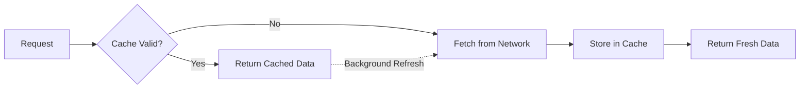

# API Documentation

## Overview

The API layer handles all HTTP communication between the Flutter app and the backend server. It provides a clean interface for making network requests with built-in caching, error handling, and authentication.

## Architecture

```
api/
├── api_client.dart          # Main HTTP client
├── api_checker.dart         # Response validation
└── api_call_manager.dart    # Caching & request management
```

## API Client

### Base Configuration

```dart
class ApiClient {
  final String appBaseUrl;
  final SharedPreferences sharedPreferences;
  
  static const String noInternetMessage = 'Connection to API server failed';
  static const int timeoutInSeconds = 30;
```

### Key Features

1. **Automatic Token Injection**: Auth token added to all requests
2. **Zone Management**: Zone ID included in headers
3. **Multi-language Support**: Language code in headers
4. **Request Logging**: Detailed logging for debugging
5. **Error Handling**: Consistent error responses
6. **Timeout Configuration**: 30-second default timeout

### HTTP Methods

#### GET Request

```dart
Future<Response> getData(
  String uri, {
  Map<String, dynamic>? query,
  Map<String, String>? headers,
}) async {
  try {
    final response = await http.get(
      Uri.parse(appBaseUrl + uri).replace(queryParameters: query),
      headers: _setHeaders(headers),
    ).timeout(Duration(seconds: timeoutInSeconds));
    
    return _handleResponse(response, uri);
  } catch (e) {
    return Response(statusCode: 1, statusText: noInternetMessage);
  }
}
```

#### POST Request

```dart
Future<Response> postData(
  String uri, 
  dynamic body, {
  Map<String, String>? headers,
}) async {
  try {
    final response = await http.post(
      Uri.parse(appBaseUrl + uri),
      body: jsonEncode(body),
      headers: _setHeaders(headers),
    ).timeout(Duration(seconds: timeoutInSeconds));
    
    return _handleResponse(response, uri);
  } catch (e) {
    return Response(statusCode: 1, statusText: noInternetMessage);
  }
}
```

#### PUT Request

```dart
Future<Response> putData(
  String uri, 
  dynamic body, {
  Map<String, String>? headers,
}) async {
  // Similar to POST
}
```

#### DELETE Request

```dart
Future<Response> deleteData(
  String uri, {
  Map<String, String>? headers,
}) async {
  try {
    final response = await http.delete(
      Uri.parse(appBaseUrl + uri),
      headers: _setHeaders(headers),
    ).timeout(Duration(seconds: timeoutInSeconds));
    
    return _handleResponse(response, uri);
  } catch (e) {
    return Response(statusCode: 1, statusText: noInternetMessage);
  }
}
```

#### Multipart Request (File Upload)

```dart
Future<Response> postMultipartData(
  String uri,
  Map<String, String> body,
  List<MultipartBody> multipartBody, {
  Map<String, String>? headers,
}) async {
  try {
    var request = http.MultipartRequest('POST', Uri.parse(appBaseUrl + uri));
    request.headers.addAll(_setHeaders(headers));
    
    // Add fields
    request.fields.addAll(body);
    
    // Add files
    for (var multipart in multipartBody) {
      request.files.add(http.MultipartFile(
        multipart.key,
        multipart.file.readAsBytes().asStream(),
        multipart.file.lengthSync(),
        filename: multipart.file.path.split('/').last,
      ));
    }
    
    var response = await request.send();
    return Response(
      statusCode: response.statusCode,
      body: await response.stream.bytesToString(),
    );
  } catch (e) {
    return Response(statusCode: 1, statusText: noInternetMessage);
  }
}
```

### Header Management

```dart
Map<String, String> _setHeaders(Map<String, String>? headers) {
  final Map<String, String> mainHeaders = {
    'Content-Type': 'application/json',
    'Accept': 'application/json',
    'moduleId': _getModuleId().toString(),
    'zoneId': _getZoneIds(),
  };
  
  // Add auth token if available
  String? token = sharedPreferences.getString(AppConstants.TOKEN);
  if (token != null && token.isNotEmpty) {
    mainHeaders['Authorization'] = 'Bearer $token';
  }
  
  // Add language
  String? language = sharedPreferences.getString(AppConstants.LANGUAGE_CODE);
  if (language != null) {
    mainHeaders['X-localization'] = language;
  }
  
  // Merge with custom headers
  if (headers != null) {
    mainHeaders.addAll(headers);
  }
  
  return mainHeaders;
}
```

### Response Handling

```dart
Response _handleResponse(http.Response response, String uri) {
  Response resp = Response(
    body: response.body,
    bodyBytes: response.bodyBytes,
    headers: response.headers,
    statusCode: response.statusCode,
    statusText: response.reasonPhrase,
  );
  
  // Log response
  if (kDebugMode) {
    print('====> API Response: [$uri] | Status: ${resp.statusCode}');
    print('====> Response Body: ${resp.body}');
  }
  
  return resp;
}
```

## API Call Manager

Manages API calls with intelligent caching.

### Features

- **Disk Caching**: Persist responses to disk
- **Memory Caching**: Fast in-memory cache
- **TTL Support**: Time-based cache expiration
- **Selective Caching**: Control which endpoints to cache

### Usage

```dart
// With caching enabled
final response = await ApiCallManager.instance.request(
  url: '/api/v1/stores',
  method: 'GET',
  cacheKey: 'stores_list',
  cacheDuration: Duration(minutes: 5),
  fromCache: (cachedData) {
    // Load from cache first (fast)
    return StoreModel.fromJson(cachedData);
  },
  fromNetwork: (networkData) {
    // Then fetch from network (fresh)
    return StoreModel.fromJson(networkData);
  },
);
```

### Cache Strategy



## API Checker

Validates API responses and handles common errors.

### Error Codes

| Status Code | Meaning | Action |
|------------|---------|--------|
| 200 | Success | Process response |
| 400 | Bad Request | Show error message |
| 401 | Unauthorized | Logout user |
| 403 | Forbidden | Show access denied |
| 404 | Not Found | Show not found message |
| 500 | Server Error | Show generic error |
| 503 | Service Unavailable | Show maintenance message |

### Usage

```dart
Response response = await apiClient.getData('/endpoint');
ApiChecker.checkApi(response);

if (response.statusCode == 200) {
  // Process successful response
  var data = jsonDecode(response.body);
} else {
  // Error already handled by ApiChecker
}
```

### Implementation

```dart
class ApiChecker {
  static void checkApi(Response response) {
    if (response.statusCode == 401) {
      // Unauthorized - clear session and redirect to login
      Get.find<AuthController>().clearSharedData();
      Get.offAllNamed(RouteHelper.getSignInRoute());
      showCustomSnackBar('Session expired. Please login again.');
    } 
    else if (response.statusCode == 403) {
      showCustomSnackBar('Access denied');
    }
    else if (response.statusCode == 500) {
      showCustomSnackBar('Internal server error');
    }
    else if (response.statusCode == 503) {
      showCustomSnackBar('Service temporarily unavailable');
    }
    else if (response.statusCode >= 400) {
      // Try to extract error message from response
      try {
        var errorData = jsonDecode(response.body);
        showCustomSnackBar(errorData['message'] ?? 'An error occurred');
      } catch (e) {
        showCustomSnackBar('An error occurred');
      }
    }
  }
}
```

## Common API Endpoints

### Authentication

```dart
// Login
POST /api/v1/auth/login
Body: {
  "email": "user@example.com",
  "password": "password123"
}

// Register
POST /api/v1/auth/register
Body: {
  "f_name": "John",
  "l_name": "Doe",
  "email": "user@example.com",
  "phone": "+1234567890",
  "password": "password123"
}

// Social Login
POST /api/v1/auth/social-login
Body: {
  "token": "google_or_facebook_token",
  "unique_id": "social_user_id",
  "provider": "google"
}

// Verify Phone
POST /api/v1/auth/verify-phone
Body: {
  "phone": "+1234567890",
  "otp": "1234"
}
```

### Configuration

```dart
// Get app config
GET /api/v1/config

// Get module config
GET /api/v1/module-config?module_id={id}

// Get business settings
GET /api/v1/business-setup
```

### Location & Zones

```dart
// Get zones
GET /api/v1/zone/list

// Check zone by coordinates
GET /api/v1/config/get-zone-id?lat={lat}&lng={lng}

// Get place details
GET /api/v1/config/place-api-autocomplete?search_text={query}
```

### Stores

```dart
// Get store list
GET /api/v1/stores/?type=latest&offset=0&limit=10

// Get store details
GET /api/v1/stores/details/{store_id}

// Search stores
GET /api/v1/stores/search?name={query}&offset=0&limit=10

// Get popular stores
GET /api/v1/stores/popular?offset=0&limit=10
```

### Items/Products

```dart
// Get item details
GET /api/v1/items/details/{item_id}

// Get latest items
GET /api/v1/items/latest?store_id={id}&category_id={id}

// Search items
GET /api/v1/items/search?name={query}

// Get featured items
GET /api/v1/items/featured?offset=0&limit=10
```

### Categories

```dart
// Get categories
GET /api/v1/categories

// Get category items
GET /api/v1/categories/{category_id}/items
```

### Banners

```dart
// Get banners
GET /api/v1/banners?featured=1

// Get promotional banners
GET /api/v1/banners?type=promotional
```

### Cart

```dart
// Add to cart (local - no API)
// Update cart (local - no API)
```

### Orders

```dart
// Place order
POST /api/v1/customer/order/place
Body: {
  "cart": [...],
  "distance": 5.2,
  "address_id": 123,
  "payment_method": "cash_on_delivery"
}

// Get order list
GET /api/v1/customer/order/list?offset=0&limit=10

// Get order details
GET /api/v1/customer/order/details?order_id={id}

// Track order
GET /api/v1/customer/order/track?order_id={id}

// Cancel order
POST /api/v1/customer/order/cancel
Body: {
  "order_id": 123,
  "reason": "Changed my mind"
}
```

### User Profile

```dart
// Get profile
GET /api/v1/customer/info

// Update profile
PUT /api/v1/customer/update-profile
Body: {
  "f_name": "John",
  "l_name": "Doe",
  "email": "user@example.com",
  "phone": "+1234567890"
}

// Update profile image
POST /api/v1/customer/update-profile (multipart)
```

### Address Management

```dart
// Get address list
GET /api/v1/customer/address/list

// Add address
POST /api/v1/customer/address/add
Body: {
  "contact_person_name": "John Doe",
  "address_type": "home",
  "address": "123 Main St",
  "latitude": "40.7128",
  "longitude": "-74.0060"
}

// Delete address
DELETE /api/v1/customer/address/delete?address_id={id}
```

### Wallet

```dart
// Get wallet balance
GET /api/v1/customer/wallet/transactions

// Add money to wallet
POST /api/v1/customer/wallet/add-fund
Body: {
  "amount": 100,
  "payment_method": "stripe"
}
```

## Response Models

### Success Response

```json
{
  "status": true,
  "message": "Success",
  "data": {
    // Response data
  }
}
```

### Error Response

```json
{
  "status": false,
  "message": "Error message",
  "errors": [
    {
      "field": "email",
      "message": "Email is required"
    }
  ]
}
```

### Paginated Response

```json
{
  "status": true,
  "total_size": 50,
  "limit": 10,
  "offset": 0,
  "data": [
    // Array of items
  ]
}
```

## Best Practices

### 1. Always Use API Checker

```dart
Response response = await apiClient.getData('/endpoint');
ApiChecker.checkApi(response);
```

### 2. Handle Loading States

```dart
isLoading.value = true;
final response = await apiClient.getData('/endpoint');
isLoading.value = false;
```

### 3. Use Try-Catch

```dart
try {
  final response = await apiClient.getData('/endpoint');
  ApiChecker.checkApi(response);
  // Process response
} catch (e) {
  showCustomSnackBar('An error occurred: $e');
}
```

### 4. Parse JSON Safely

```dart
try {
  var data = jsonDecode(response.body);
  return ModelClass.fromJson(data);
} catch (e) {
  print('JSON parsing error: $e');
  return null;
}
```

### 5. Use Caching for Frequent Requests

```dart
// Cache home screen data for 5 minutes
ApiCallManager.instance.request(
  url: '/api/v1/home',
  cacheDuration: Duration(minutes: 5),
);
```

## Testing APIs

### Using Postman/Thunder Client

1. Set base URL: `https://your-api.com`
2. Add headers:
   ```
   Content-Type: application/json
   Authorization: Bearer {your_token}
   moduleId: 1
   zoneId: [2,4,3,5]
   ```
3. Make request
4. Verify response

### Example cURL

```bash
curl -X GET "https://your-api.com/api/v1/stores" \
  -H "Content-Type: application/json" \
  -H "Authorization: Bearer YOUR_TOKEN" \
  -H "moduleId: 1" \
  -H "zoneId: [2,4,3,5]"
```

## Error Handling Examples

```dart
// Network error
if (response.statusCode == 1) {
  showCustomSnackBar('No internet connection');
  return;
}

// Unauthorized
if (response.statusCode == 401) {
  // Already handled by ApiChecker - user redirected to login
  return;
}

// Server error
if (response.statusCode >= 500) {
  showCustomSnackBar('Server error. Please try again later.');
  return;
}

// Success
if (response.statusCode == 200) {
  var data = jsonDecode(response.body);
  // Process data
}
```

## Performance Optimization

1. **Use Caching**: Reduce network calls
2. **Pagination**: Load data in chunks
3. **Debouncing**: For search queries
4. **Parallel Requests**: Use `Future.wait()` for independent calls
5. **Cancel Requests**: Cancel ongoing requests when navigating away

```dart
// Parallel requests
final results = await Future.wait([
  apiClient.getData('/endpoint1'),
  apiClient.getData('/endpoint2'),
  apiClient.getData('/endpoint3'),
]);
```
