# API Architecture Diagrams

## API Request Flow

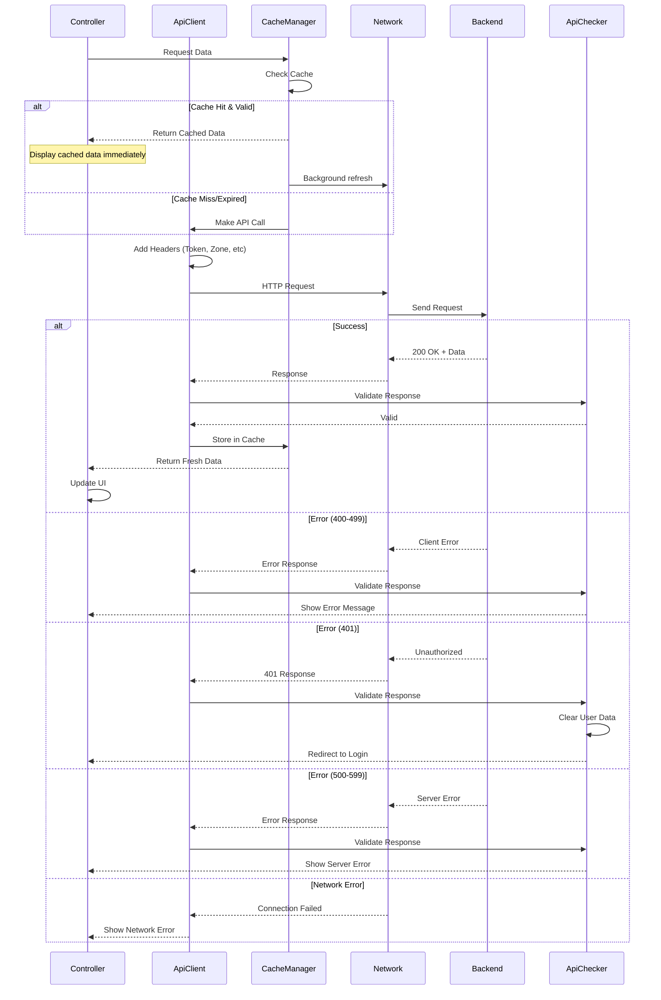

## API Client Architecture

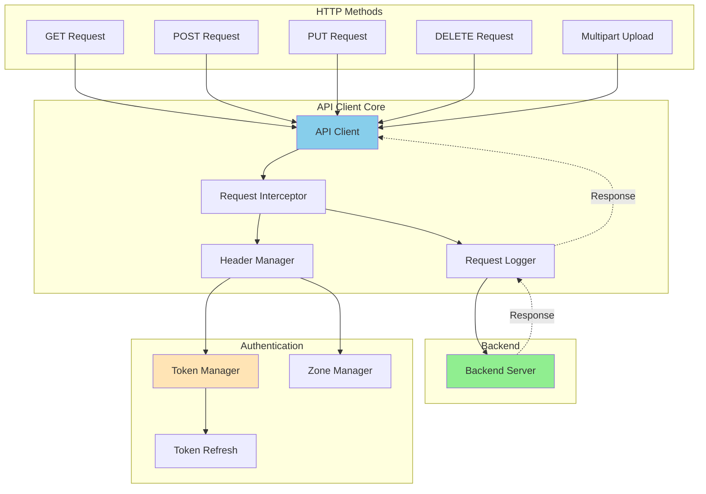

## Cache Strategy Flow

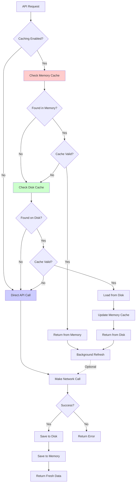

## Error Handling Flow

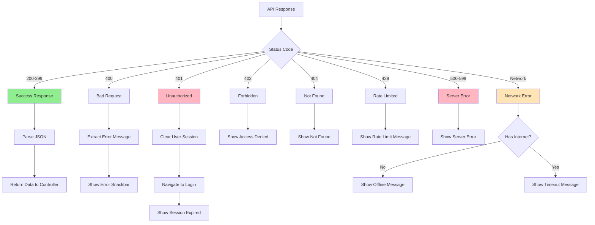

## Authentication Flow

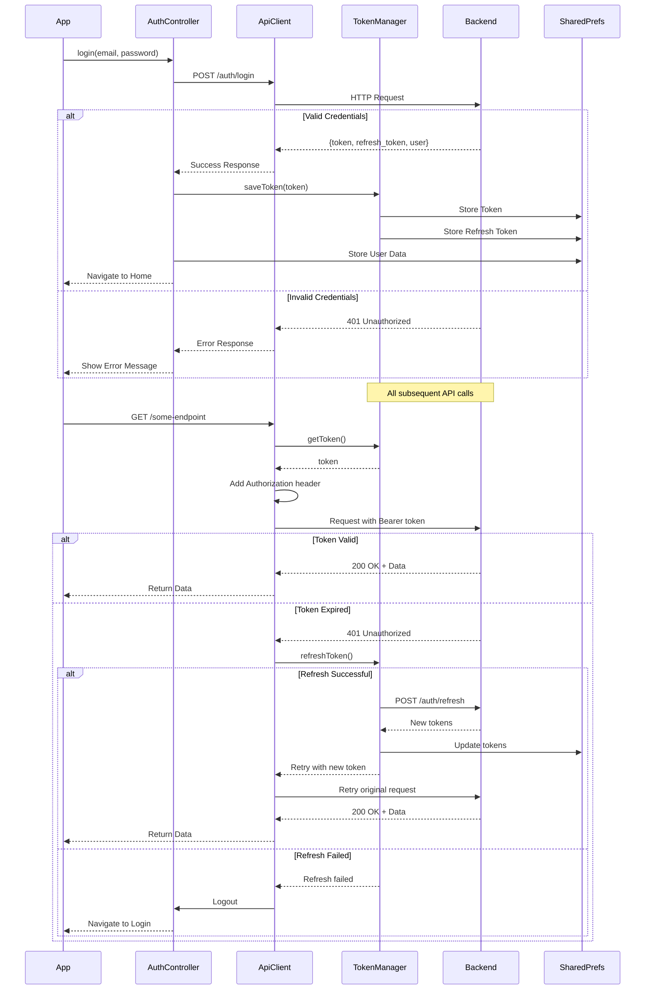

## Multi-Module API Architecture

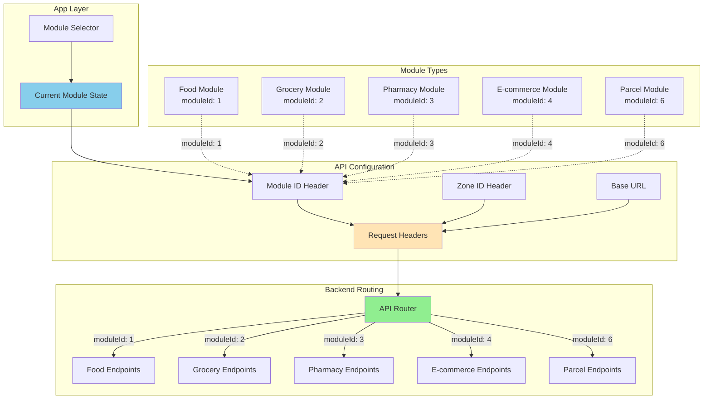

## File Upload Flow

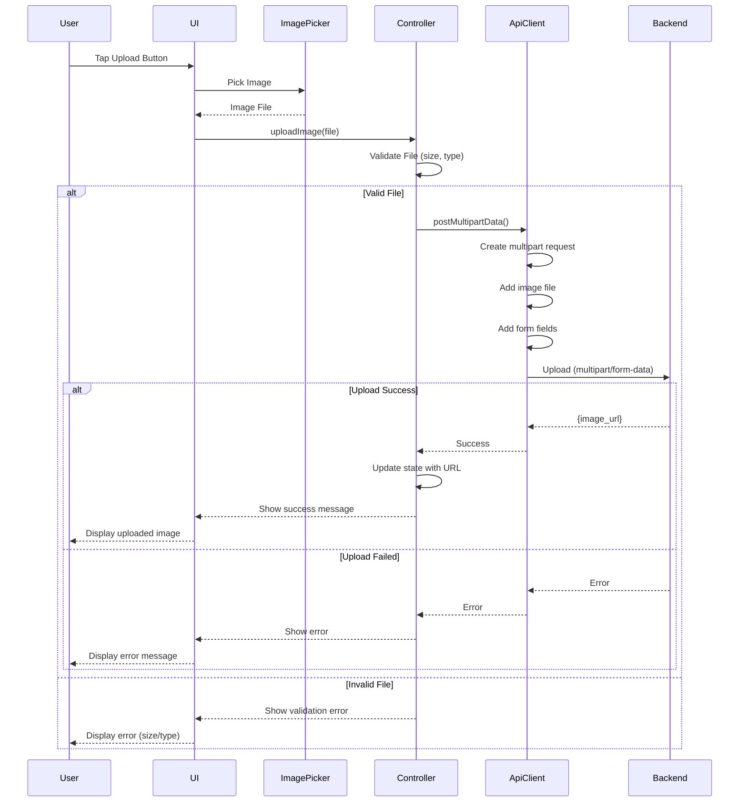

## Pagination Flow

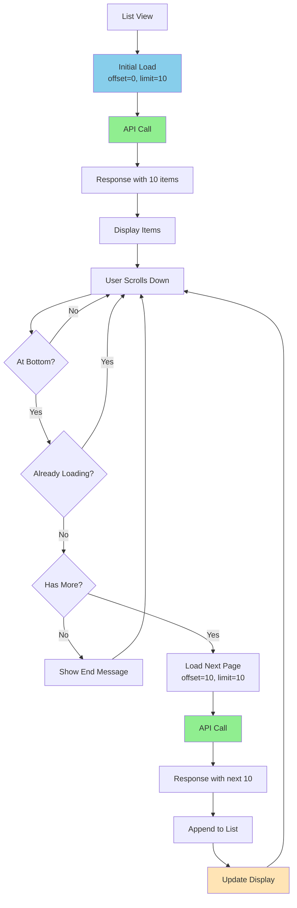

## Zone-Based API Routing

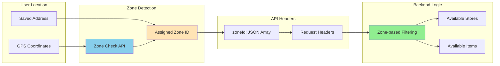

## Request Lifecycle

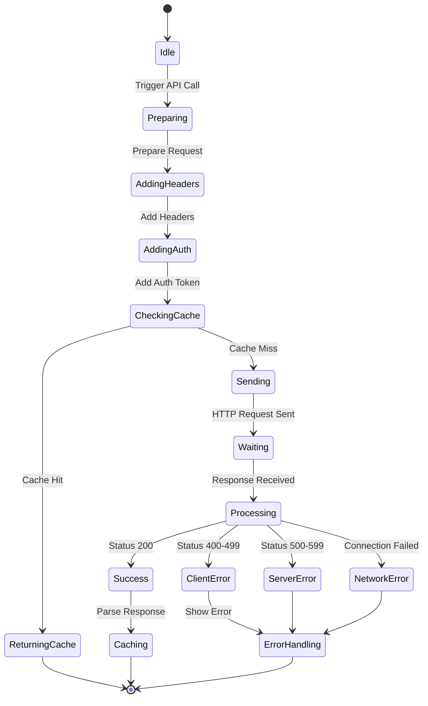

## API Retry Mechanism

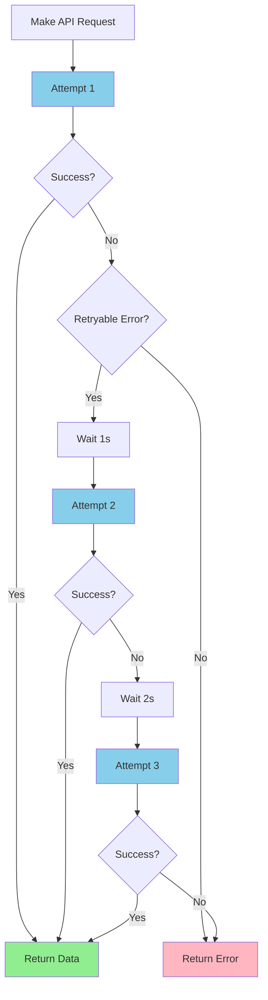
