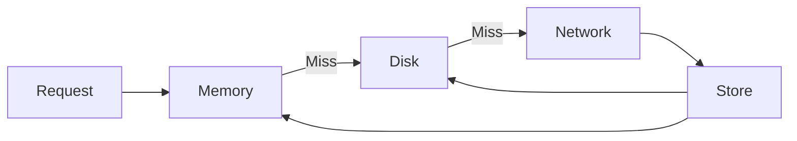

# Common Components Documentation

## Overview

The `common` directory contains shared components, utilities, and services used across all features in the application. This promotes code reusability and maintains consistency throughout the app.

## Directory Structure

```
common/
├── api/              # API client and network configuration
├── cache/            # Caching system
├── controllers/      # Shared controllers
├── enums/            # Enumeration types
├── models/           # Shared data models
├── security/         # Security utilities
├── services/         # Shared services
├── utils/            # Utility functions
└── widgets/          # Reusable UI widgets
```

## Components

### 1. API Layer
**Location**: `common/api/`

Handles all HTTP communication with the backend server.

**Key Files**:
- `api_client.dart`: Main API client with HTTP methods
- `api_checker.dart`: API response validation
- `api_call_manager.dart`: Manages API calls with caching

**Features**:
- Automatic token injection
- Request/Response interceptors
- Error handling
- Retry mechanism
- Timeout configuration
- Zone ID management

**Usage**:
```dart
final response = await Get.find<ApiClient>().getData('/endpoint');
```

### 2. Cache System
**Location**: `common/cache/`

Implements multi-layer caching (Memory + Disk) for optimized performance.

**Key Files**:
- `api_call_manager.dart`: Manages cached API calls
- `cached_splash_loader.dart`: Caches splash data

**Features**:
- Memory cache for immediate access
- Disk cache for persistence
- TTL (Time To Live) support
- Cache invalidation
- Selective caching

**Cache Strategy**:


### 3. Controllers
**Location**: `common/controllers/`

Shared GetX controllers used across multiple features.

**Key Controllers**:
- `theme_controller.dart`: App theme management
- `localization_controller.dart`: Language switching
- `search_controller.dart`: Global search functionality

### 4. Enums
**Location**: `common/enums/`

Type-safe enumeration values.

**Common Enums**:
- `module_type.dart`: Food, Grocery, Pharmacy, etc.
- `order_status.dart`: Pending, Confirmed, Delivered, etc.
- `payment_method.dart`: COD, Card, Wallet, etc.
- `user_type.dart`: Customer, Vendor, DeliveryMan

### 5. Models
**Location**: `common/models/`

Shared data models used across features.

**Key Models**:
- `config_model.dart`: App configuration
- `module_model.dart`: Module information
- `response_model.dart`: Generic API response
- `zone_model.dart`: Zone information
- `address_model.dart`: Address structure

**Model Structure**:
```dart
class ExampleModel {
  int? id;
  String? name;
  
  ExampleModel({this.id, this.name});
  
  // From JSON
  factory ExampleModel.fromJson(Map<String, dynamic> json) {
    return ExampleModel(
      id: json['id'],
      name: json['name'],
    );
  }
  
  // To JSON
  Map<String, dynamic> toJson() {
    return {
      'id': id,
      'name': name,
    };
  }
}
```

### 6. Security
**Location**: `common/security/`

Security utilities and encryption.

**Features**:
- Data encryption/decryption
- Secure storage
- Token management
- API key protection

### 7. Services
**Location**: `common/services/`

Platform-specific services and integrations.

**Key Services**:
- `notification_service.dart`: Push notification handling
- `location_service.dart`: GPS and location services
- `image_picker_service.dart`: Image selection
- `connectivity_service.dart`: Network status monitoring

### 8. Utils
**Location**: `common/utils/`

Utility functions and helpers.

**Utilities**:
- `date_converter.dart`: Date formatting
- `dimensions.dart`: Responsive dimensions
- `images.dart`: Image asset paths
- `styles.dart`: Text styles
- `app_constants.dart`: App-wide constants
- `validator.dart`: Input validation

**Example**:
```dart
// Date formatting
String formattedDate = DateConverter.dateToDateAndTime(dateTime);

// Responsive sizing
double fontSize = Dimensions.fontSizeDefault;

// Validation
bool isValid = Validator.validateEmail(email);
```

### 9. Widgets
**Location**: `common/widgets/`

Reusable UI components used throughout the app.

**Key Widgets**:
- `custom_button.dart`: Styled buttons
- `custom_text_field.dart`: Input fields
- `custom_app_bar.dart`: App bar component
- `custom_snackbar.dart`: Toast messages
- `loading_indicator.dart`: Loading states
- `empty_view.dart`: Empty state UI
- `not_available_widget.dart`: Unavailable state
- `paginated_list_view.dart`: Infinite scroll lists

**Usage**:
```dart
CustomButton(
  buttonText: 'Submit',
  onPressed: () => controller.submit(),
)
```

## Dependency Injection

Common components are registered globally:

```dart
// In main.dart
Get.lazyPut(() => ApiClient(sharedPreferences: Get.find()));
Get.lazyPut(() => ThemeController(sharedPreferences: Get.find()));
```

## Constants

**Location**: `common/utils/app_constants.dart`

**Categories**:
- API endpoints
- Shared preference keys
- Configuration values
- Default values
- App metadata

```dart
class AppConstants {
  static const String APP_NAME = 'YourApp';
  static const String BASE_URL = 'https://api.example.com';
  static const String TOKEN = 'token';
  static const double API_TIMEOUT = 30.0;
}
```

## Error Handling

Centralized error handling for consistency:

```dart
class ApiChecker {
  static void checkApi(Response response) {
    if (response.statusCode == 401) {
      // Unauthorized - logout user
      Get.find<AuthController>().clearSharedData();
      Get.offAllNamed(RouteHelper.getSignInRoute());
    } else if (response.statusCode == 500) {
      // Server error
      showCustomSnackBar('Server error occurred');
    }
  }
}
```

## Validation

Common validation rules:

```dart
class Validator {
  static String? validateEmail(String? value) {
    if (value == null || value.isEmpty) {
      return 'Email is required';
    }
    if (!GetUtils.isEmail(value)) {
      return 'Enter a valid email';
    }
    return null;
  }
  
  static String? validatePhone(String? value) {
    if (value == null || value.isEmpty) {
      return 'Phone is required';
    }
    if (value.length < 10) {
      return 'Enter a valid phone number';
    }
    return null;
  }
}
```

## Responsive Design

Screen size utilities:

```dart
class Dimensions {
  static double fontSizeSmall = Get.context!.width >= 1300 ? 10 : 8;
  static double fontSizeDefault = Get.context!.width >= 1300 ? 12 : 10;
  static double fontSizeLarge = Get.context!.width >= 1300 ? 16 : 14;
  
  static double paddingSmall = Get.context!.width >= 1300 ? 5 : 3;
  static double paddingDefault = Get.context!.width >= 1300 ? 10 : 8;
  static double paddingLarge = Get.context!.width >= 1300 ? 20 : 15;
}
```

## Theme Management

Dynamic theme switching:

```dart
class ThemeController extends GetxController {
  bool _darkTheme = false;
  bool get darkTheme => _darkTheme;
  
  void toggleTheme() {
    _darkTheme = !_darkTheme;
    // Save to preferences
    // Update app theme
    Get.changeThemeMode(_darkTheme ? ThemeMode.dark : ThemeMode.light);
    update();
  }
}
```

## Localization

Multi-language support:

```dart
class LocalizationController extends GetxController {
  Locale _locale = Locale('en', 'US');
  Locale get locale => _locale;
  
  void setLanguage(Locale locale) {
    _locale = locale;
    // Save to preferences
    // Update app locale
    Get.updateLocale(locale);
    update();
  }
}
```

## Network Monitoring

Check connectivity status:

```dart
class ConnectivityService extends GetxService {
  final Rx<ConnectivityResult> connectionStatus = ConnectivityResult.none.obs;
  
  @override
  void onInit() {
    super.onInit();
    Connectivity().onConnectivityChanged.listen((result) {
      connectionStatus.value = result;
      if (result == ConnectivityResult.none) {
        showCustomSnackBar('No internet connection');
      }
    });
  }
}
```

## Best Practices

### 1. Use Common Components
Avoid duplicating code by using shared components:
```dart
// Good
CustomButton(buttonText: 'Submit', onPressed: () {});

// Bad - creating custom button in each feature
Container(/* custom button implementation */);
```

### 2. Centralize Constants
Define constants in one place:
```dart
// Good
AppConstants.BASE_URL

// Bad
const String baseUrl = 'https://api.example.com';
```

### 3. Consistent Error Handling
Use ApiChecker for all API responses:
```dart
ApiChecker.checkApi(response);
```

### 4. Null Safety
Always handle nullable values:
```dart
String? name = model.name;
Text(name ?? 'Unknown');
```

### 5. Responsive Design
Use Dimensions for sizing:
```dart
// Good
fontSize: Dimensions.fontSizeDefault

// Bad
fontSize: 14
```

## Testing Common Components

Example test for utility function:

```dart
test('DateConverter formats date correctly', () {
  DateTime date = DateTime(2024, 1, 15);
  String formatted = DateConverter.dateToDateAndTime(date);
  expect(formatted, '15 Jan 2024, 12:00 AM');
});
```

## Documentation Links

- [API Documentation](../api/README.md)
- [Cache System](./cache/README.md)
- [Widget Library](./widgets/README.md)
- [Architecture Diagrams](../diagrams.md)
