# Common Components Architecture Diagrams

## API Client Architecture

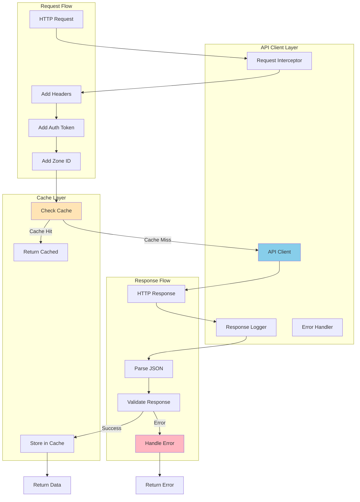

## Cache System Architecture

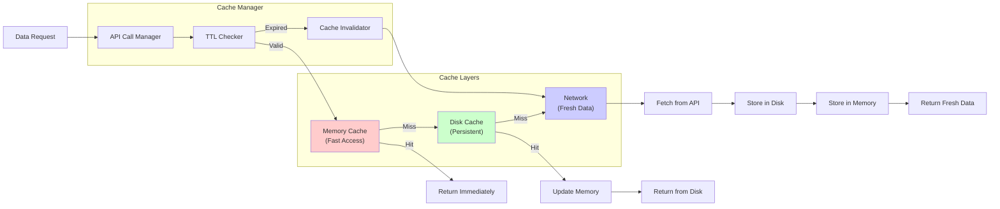

## State Management with GetX

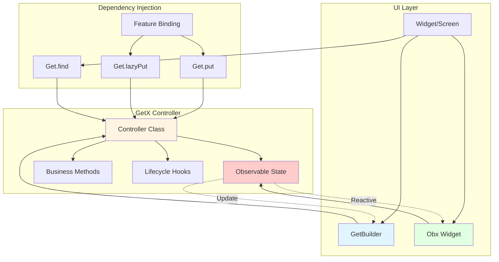

## Theme Management Flow

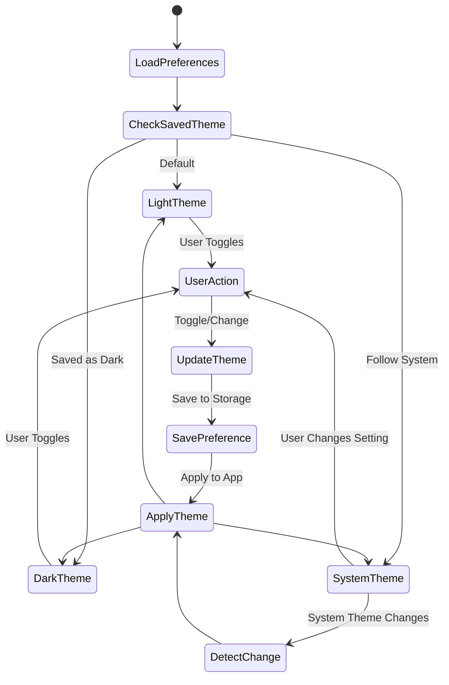

## Localization System

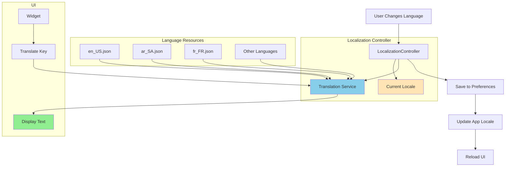

## Validation System

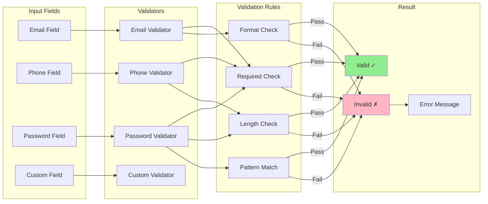

## Widget Hierarchy

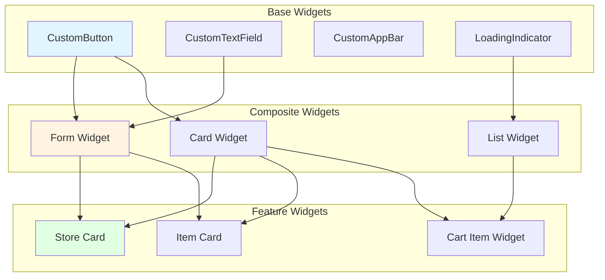

## Error Handling Flow

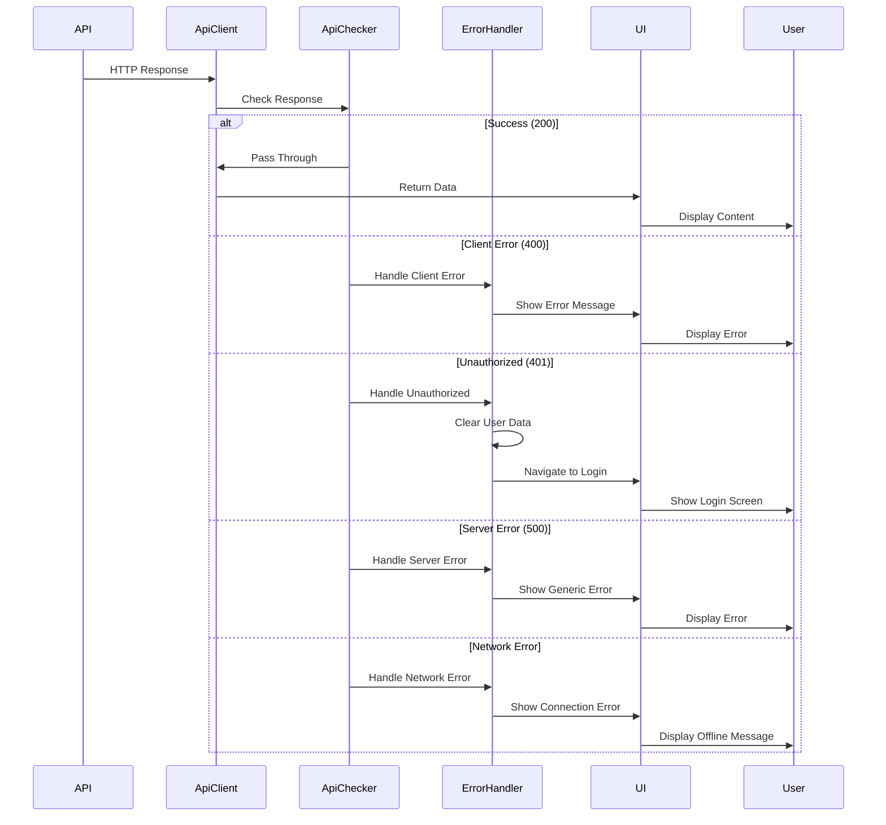

## Security Layer Architecture

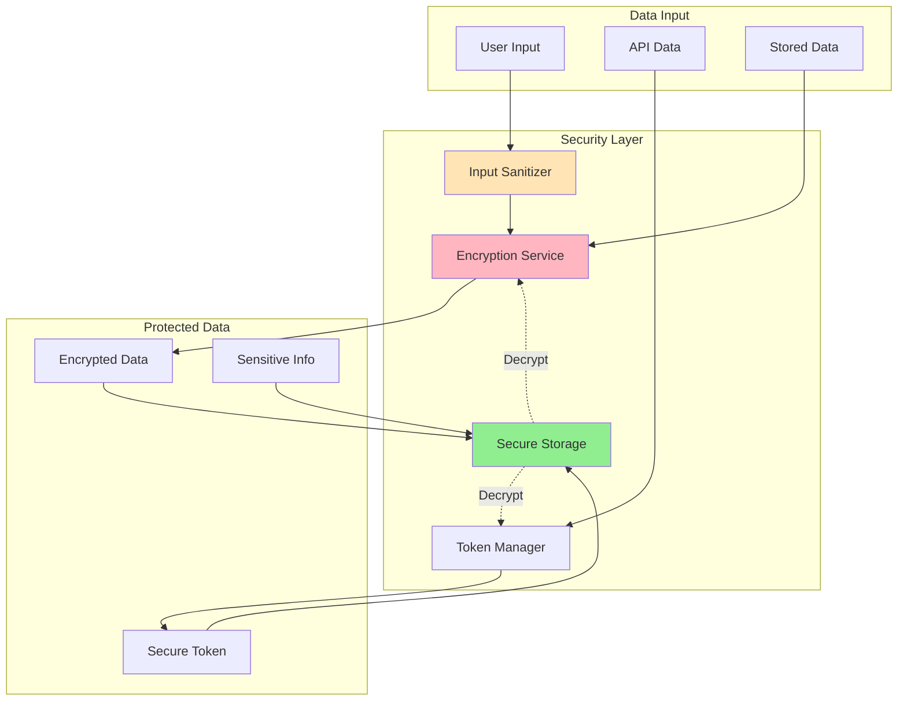

## Notification Service Architecture

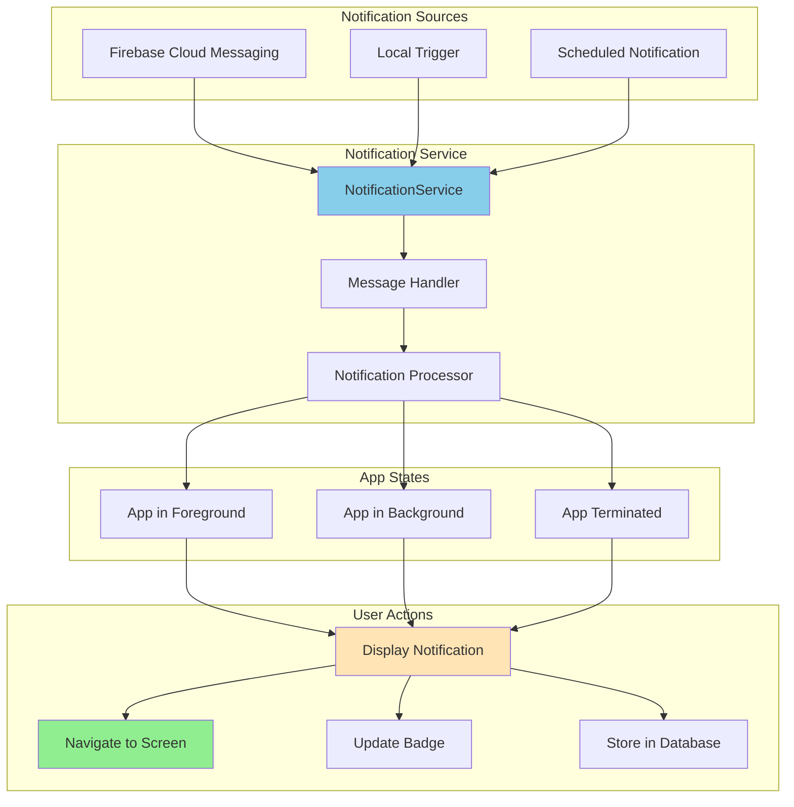

## Responsive Design System

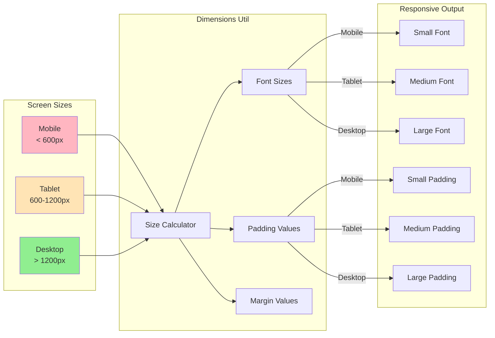

## Image Loading & Caching

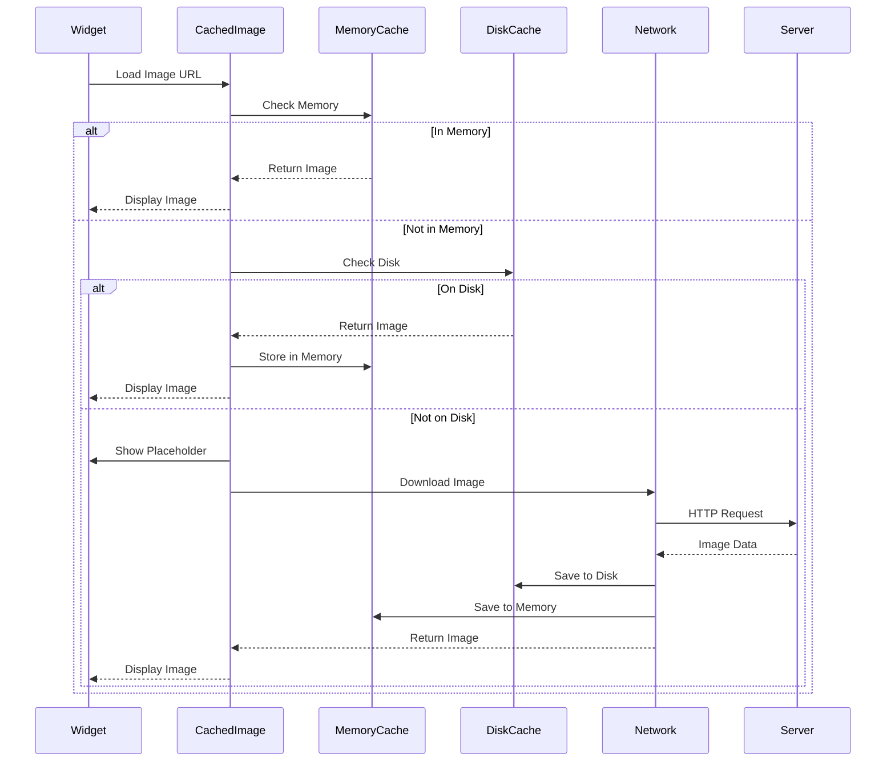

## Pagination System

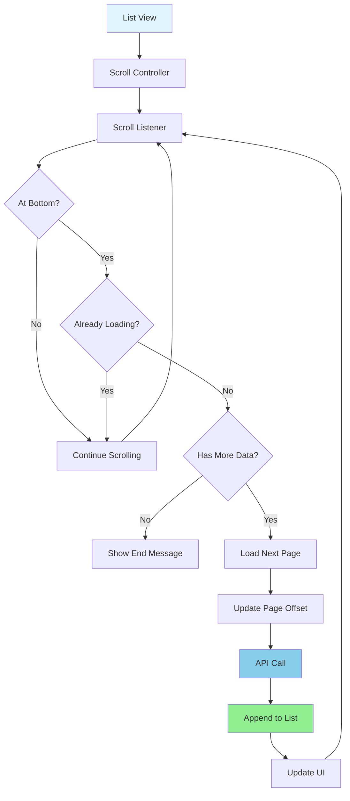
