# Architecture Diagrams

## Application Architecture Overview

### High-Level Architecture

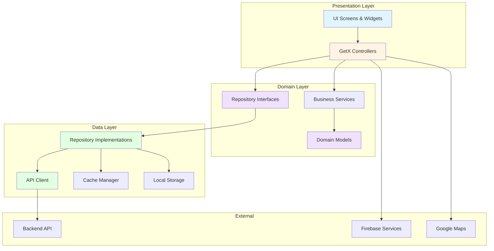

## Module System Architecture

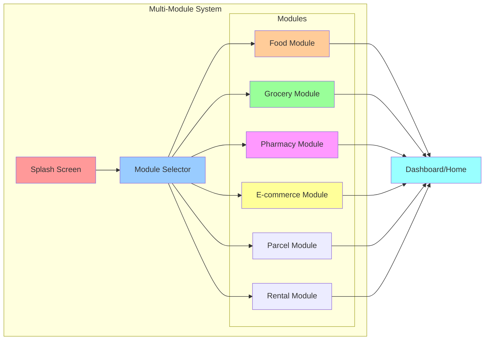

## Data Flow Architecture

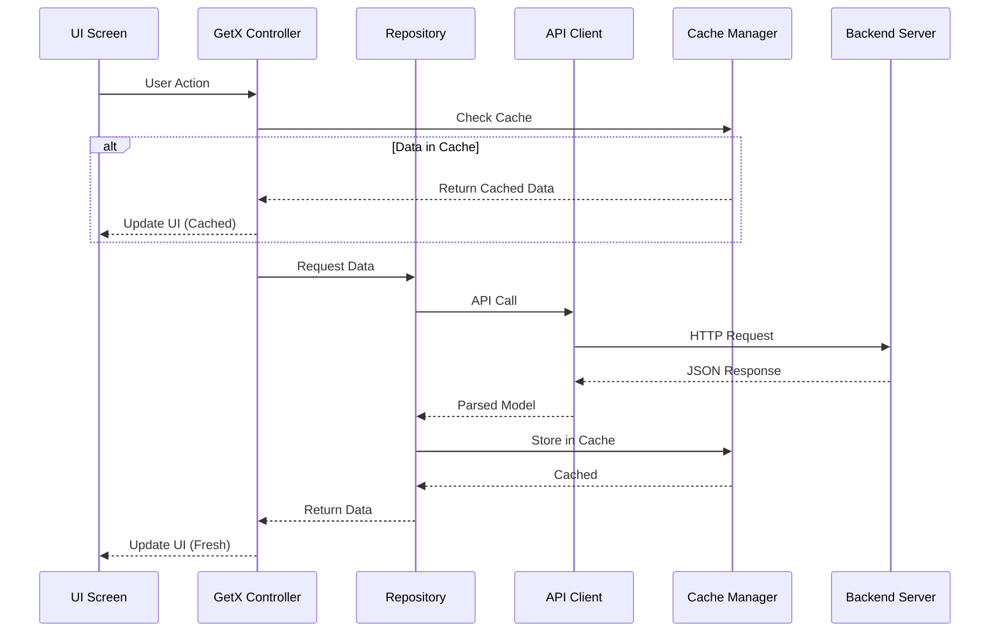

## Feature Module Structure

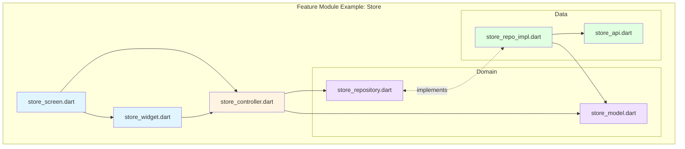

## State Management Flow (GetX)

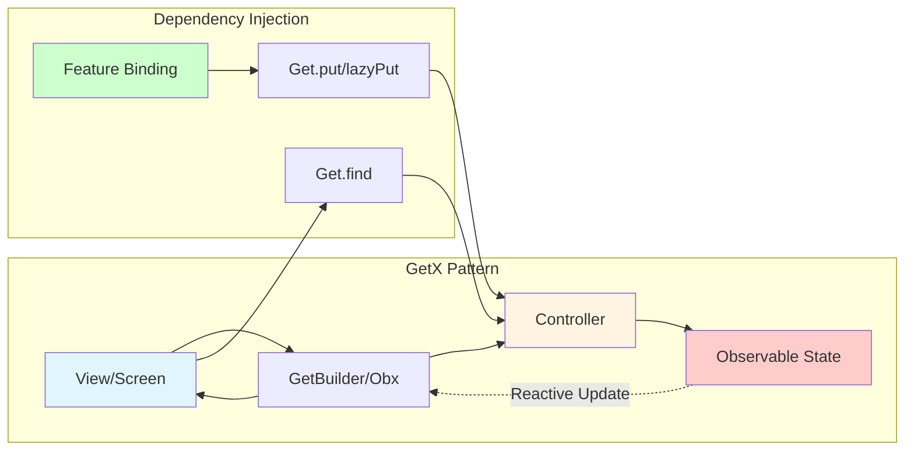

## Navigation Flow

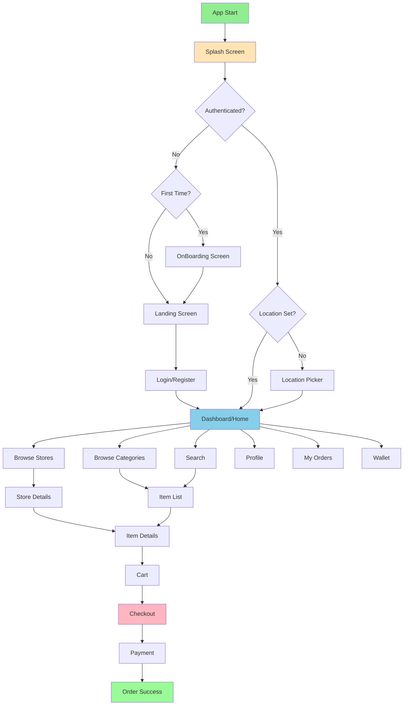

## API Call Manager Flow

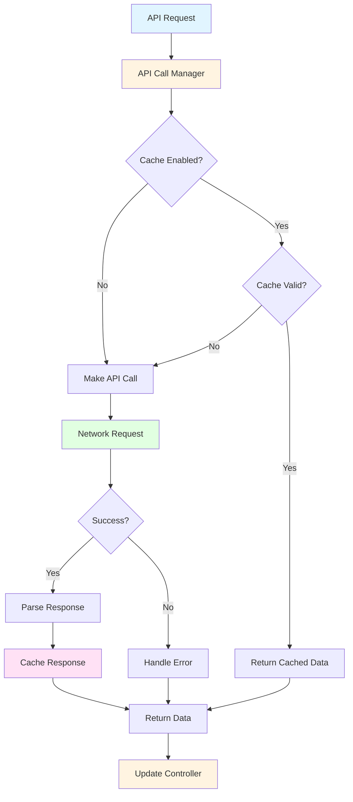

## Authentication Flow

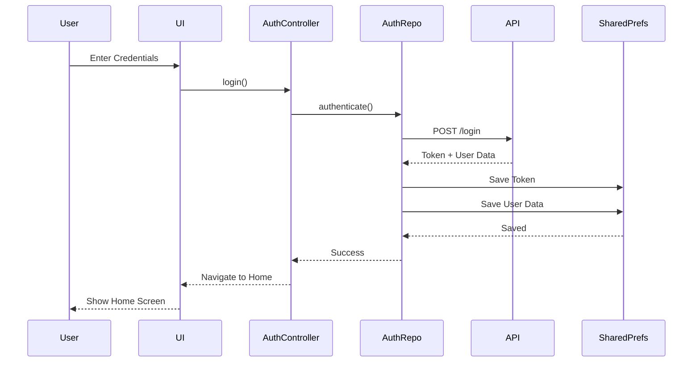

## Cart & Checkout Flow

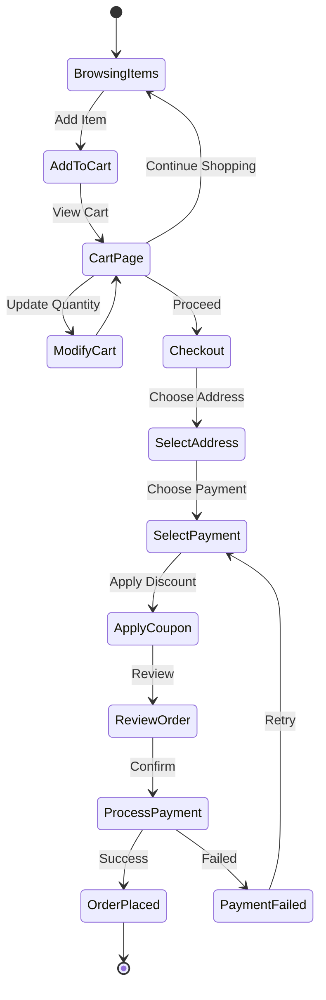

## Location & Zone Management

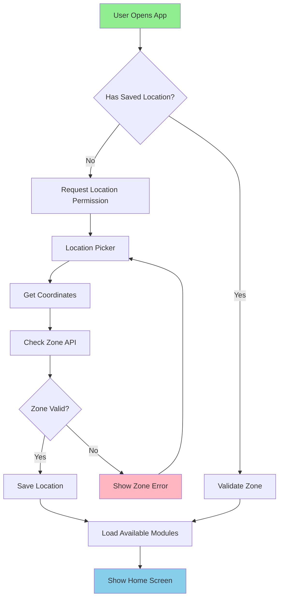

## Caching Strategy

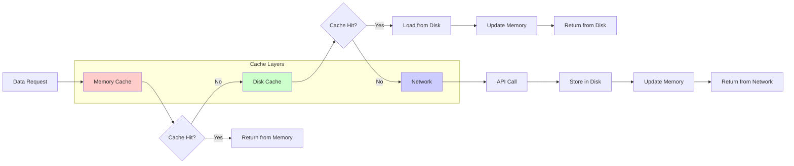

## Multi-Store Cart Architecture

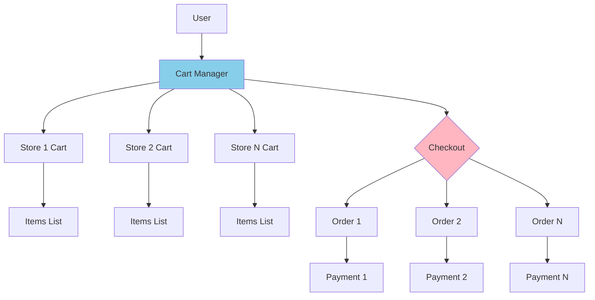

## Notification System

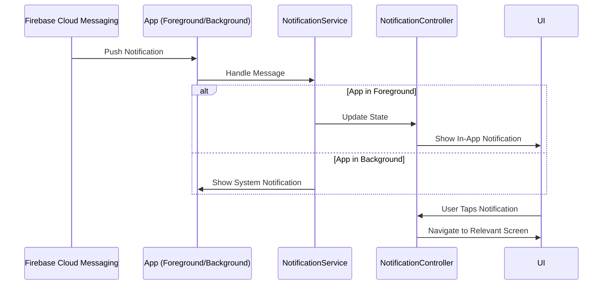

## Order Lifecycle

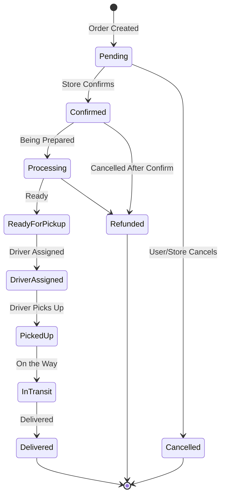
