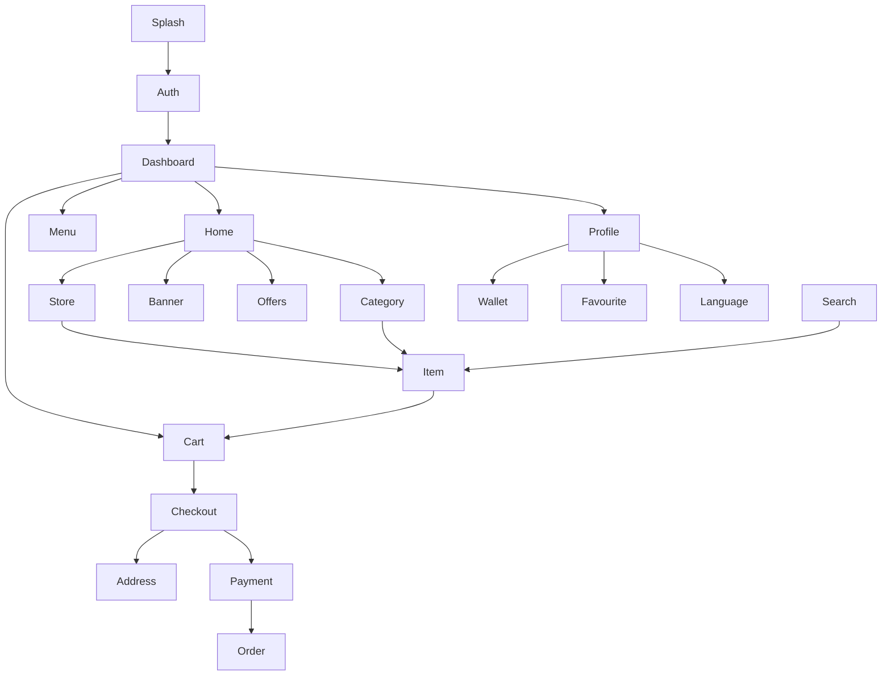

# Features Documentation

## Overview

The `features` directory contains all the main feature modules of the application. Each feature follows **Clean Architecture** principles with clear separation between presentation, domain, and data layers.

## Module Structure

Each feature module typically contains:

```
feature_name/
├── controllers/         # GetX controllers (State Management)
├── screens/            # UI screens
├── widgets/            # Feature-specific widgets
├── domain/             # Business logic layer
│   ├── models/        # Domain entities
│   ├── repositories/  # Repository interfaces
│   └── services/      # Domain services (optional)
└── data/              # Data layer (optional)
    └── repositories/  # Repository implementations
```

## Core Features

### 1. Authentication & Onboarding
- **[auth](./auth/README.md)**: User authentication (Login, Register, Social Login)
- **[onboard](./onboard/README.md)**: First-time user onboarding experience
- **[verification](./verification/README.md)**: Phone/Email verification
- **[language](./language/README.md)**: Multi-language support

### 2. Home & Navigation
- **[splash](./splash/README.md)**: App initialization and splash screen
- **[dashboard](./dashboard/README.md)**: Main navigation dashboard
- **[home](./home/README.md)**: Home screen with dynamic sections
- **[menu](./menu/README.md)**: Navigation menu

### 3. Location & Address
- **[location](./location/README.md)**: Location services and permissions
- **[address](./address/README.md)**: Address management (Add, Edit, Delete)

### 4. Store & Products
- **[store](./store/README.md)**: Store listing and details
- **[item](./item/README.md)**: Product/Item details and variants
- **[category](./category/README.md)**: Category browsing and filtering
- **[brands](./brands/README.md)**: Brand-based filtering
- **[search](./search/README.md)**: Advanced search functionality

### 5. Cart & Checkout
- **[cart](./cart/README.md)**: Shopping cart management
- **[checkout](./checkout/README.md)**: Checkout process
- **[payment](./payment/README.md)**: Payment method selection
- **[online_payment](./online_payment/README.md)**: Online payment gateway integration

### 6. Orders
- **[order](./order/README.md)**: Order history, tracking, and management
- **[parcel](./parcel/README.md)**: Parcel delivery feature

### 7. Promotions & Discounts
- **[banner](./banner/README.md)**: Banner management and display
- **[offers](./offers/README.md)**: Special offers and deals
- **[flash_sale](./flash_sale/README.md)**: Flash sale campaigns
- **[discount](./discount/README.md)**: Discount management
- **[my_coupon](./my_coupon/README.md)**: User coupon management

### 8. User Engagement
- **[favourite](./favourite/README.md)**: Favorite stores and items
- **[review](./review/README.md)**: Rating and review system
- **[loyalty](./loyalty/README.md)**: Loyalty points and rewards
- **[refer_and_earn](./refer_and_earn/README.md)**: Referral program
- **[interest](./interest/README.md)**: User interest preferences

### 9. Financial
- **[wallet](./wallet/README.md)**: In-app wallet
- **[wallet_transfer](./wallet_transfer/README.md)**: Wallet-to-wallet transfers
- **[wallet_kaidha_subscription](./wallet_kaidha_subscription/README.md)**: Subscription management

### 10. Communication & Support
- **[chat](./chat/README.md)**: In-app messaging
- **[notification](./notification/README.md)**: Push and in-app notifications
- **[support](./support/README.md)**: Customer support

### 11. User Profile
- **[profile](./profile/README.md)**: User profile management
- **[add_delegate](./add_delegate/README.md)**: Delegate user management

### 12. Special Modules
- **[rental_module](./rental_module/README.md)**: Rental service feature
- **[business](./business/README.md)**: Business settings and configuration

### 13. Miscellaneous
- **[html](./html/README.md)**: HTML page viewer (Terms, Privacy Policy)
- **[update](./update/README.md)**: App update management
- **[statistics](./statistics/README.md)**: Analytics and statistics

## Feature Count

Total Features: **44**

## Common Patterns

### Controller Pattern

All features use **GetX Controllers** for state management:

```dart
class FeatureController extends GetxController {
  // Observable state
  final RxBool isLoading = false.obs;
  final Rx<ModelType?> data = Rx<ModelType?>(null);
  
  // Dependencies
  final FeatureRepository repository;
  
  // Constructor with dependency injection
  FeatureController({required this.repository});
  
  // Lifecycle
  @override
  void onInit() {
    super.onInit();
    fetchData();
  }
  
  // Business logic
  Future<void> fetchData() async {
    isLoading.value = true;
    final result = await repository.getData();
    data.value = result;
    isLoading.value = false;
  }
}
```

### Screen Pattern

Screens are stateless widgets that use GetX for state management:

```dart
class FeatureScreen extends StatelessWidget {
  @override
  Widget build(BuildContext context) {
    return GetBuilder<FeatureController>(
      builder: (controller) {
        return Scaffold(
          appBar: AppBar(title: Text('Feature')),
          body: controller.isLoading.value
              ? LoadingWidget()
              : ContentWidget(data: controller.data.value),
        );
      },
    );
  }
}
```

### Repository Pattern

Features use repository pattern for data access:

```dart
// Interface (Domain layer)
abstract class FeatureRepository {
  Future<ModelType> getData();
  Future<void> saveData(ModelType data);
}

// Implementation (Data layer)
class FeatureRepositoryImpl implements FeatureRepository {
  final ApiClient apiClient;
  
  @override
  Future<ModelType> getData() async {
    final response = await apiClient.getData('/endpoint');
    return ModelType.fromJson(response.body);
  }
}
```

### Dependency Injection

Features use GetX bindings for dependency injection:

```dart
class FeatureBinding extends Bindings {
  @override
  void dependencies() {
    Get.lazyPut(() => FeatureController(
      repository: Get.find<FeatureRepository>(),
    ));
  }
}
```

## Navigation

Features are accessed through GetX routing:

```dart
// Define route
static const String FEATURE_ROUTE = '/feature';

// Navigate
Get.toNamed(RouteHelper.FEATURE_ROUTE);

// Navigate with parameters
Get.toNamed(RouteHelper.FEATURE_ROUTE, arguments: {'id': 123});
```

## State Management Approaches

1. **Reactive (Obx)**: For simple reactive updates
   ```dart
   Obx(() => Text(controller.count.value.toString()))
   ```

2. **GetBuilder**: For complex widget rebuilds
   ```dart
   GetBuilder<Controller>(
     builder: (controller) => YourWidget(),
   )
   ```

3. **GetX**: Combined reactive and dependency injection
   ```dart
   GetX<Controller>(
     builder: (controller) => Text(controller.data.value),
   )
   ```

## Best Practices

### 1. Single Responsibility
Each feature handles one specific domain of the application.

### 2. Dependency Injection
Use GetX bindings to inject dependencies, making testing easier.

### 3. Separation of Concerns
- **Controllers**: State and business logic
- **Screens**: UI layout
- **Widgets**: Reusable UI components
- **Models**: Data structures
- **Repositories**: Data access

### 4. Error Handling
Always handle errors gracefully:
```dart
try {
  await repository.getData();
} catch (e) {
  showCustomSnackBar('Error: ${e.message}');
}
```

### 5. Loading States
Show loading indicators during async operations:
```dart
if (controller.isLoading) {
  return CircularProgressIndicator();
}
```

### 6. Null Safety
Utilize Dart's null safety features:
```dart
ModelType? nullableData;
ModelType nonNullableData;
```

## Module-Specific Features

Certain features are only available in specific modules:

### Food Module
- Store listings with restaurant-specific features
- Food item variants and addons
- Table booking

### Grocery Module
- Category-heavy navigation
- Unit-based products
- Prescription upload (Pharmacy)

### E-commerce Module
- Brand filtering
- Product variants (size, color)
- Wishlist

### Parcel Module
- Parcel category selection
- Distance-based pricing
- Sender/Receiver information

### Rental Module
- Rental duration selection
- Availability calendar
- Booking management

## Feature Dependencies



## Testing Features

Each feature should have corresponding tests:
- **Unit Tests**: Test controllers and business logic
- **Widget Tests**: Test UI components
- **Integration Tests**: Test complete user flows

## Documentation Links

For detailed documentation of each feature, click on the feature name in the lists above.
