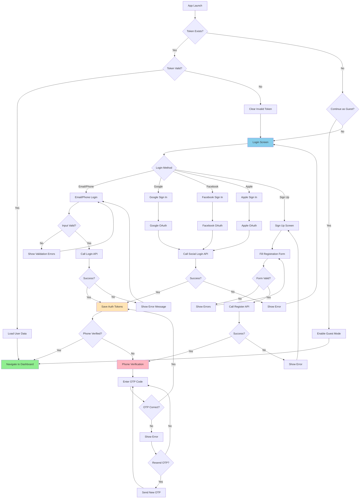
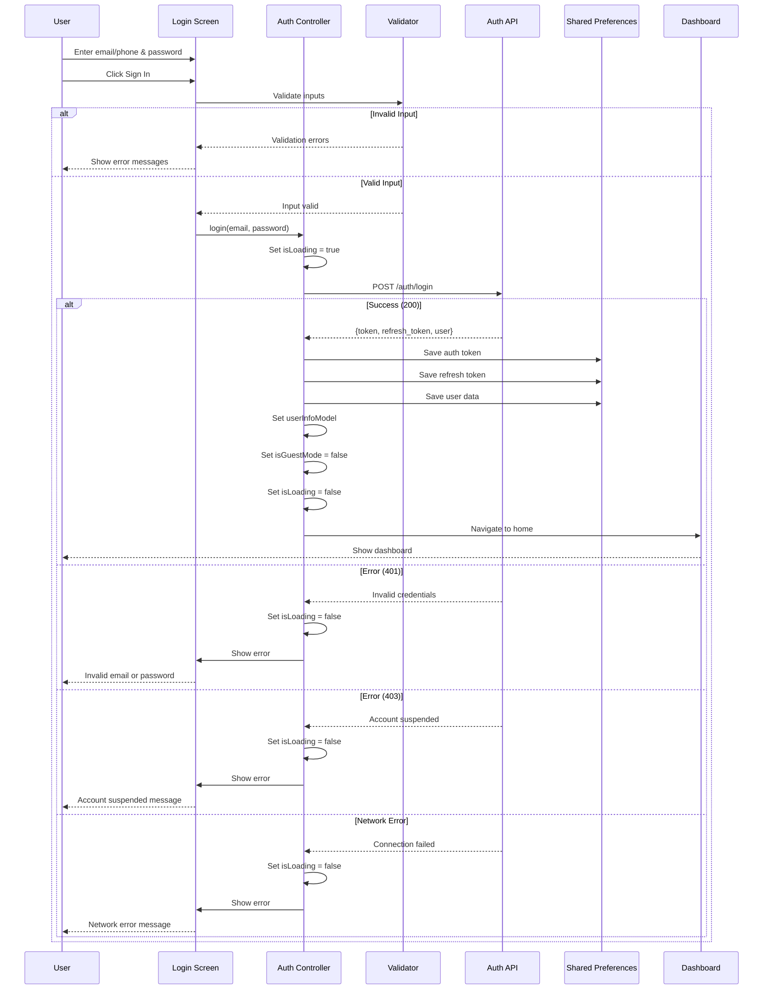
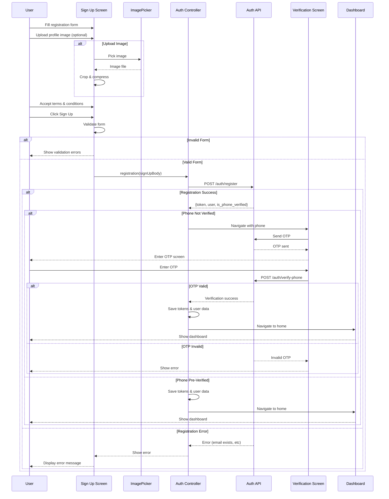
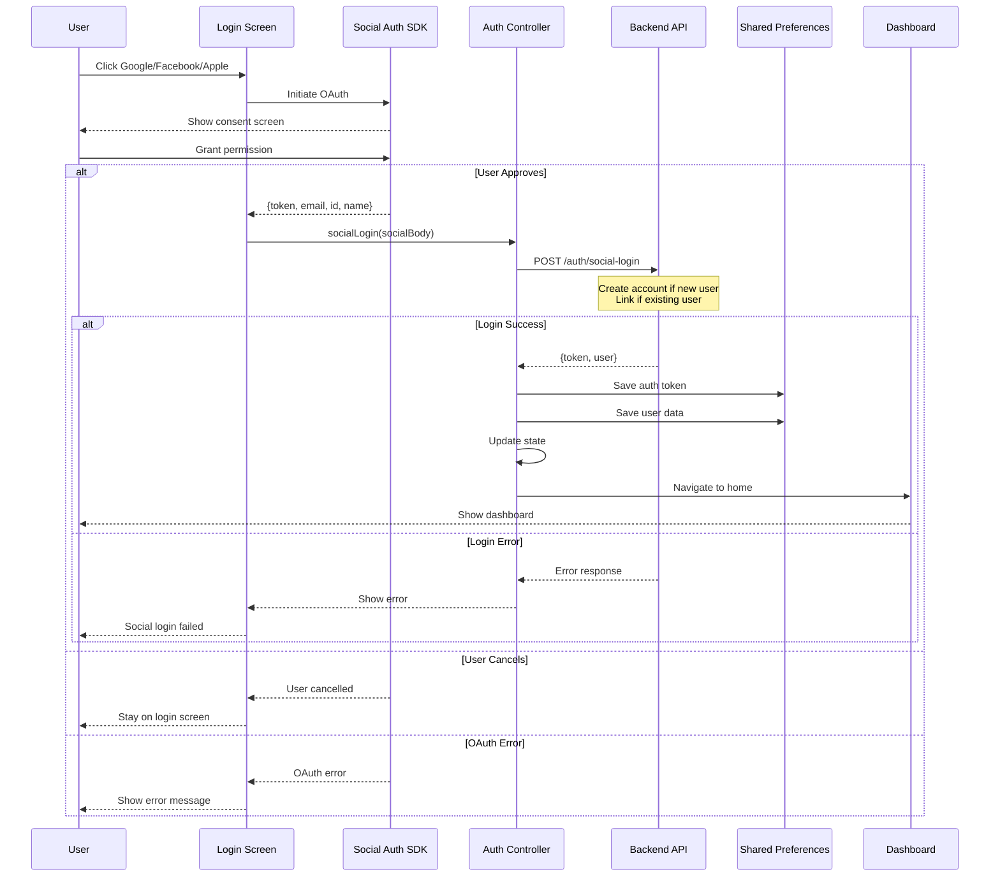
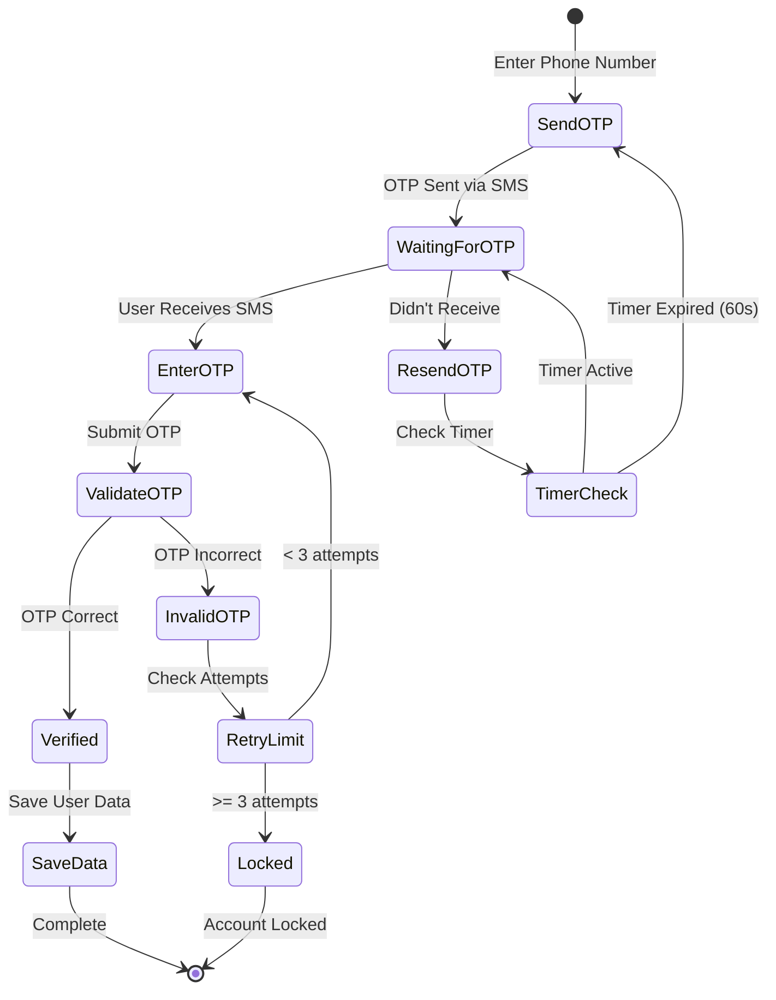
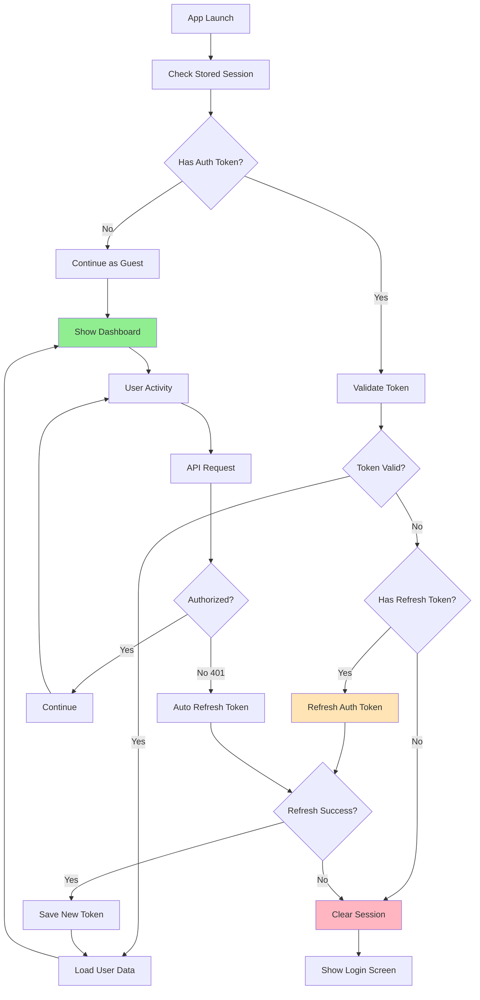
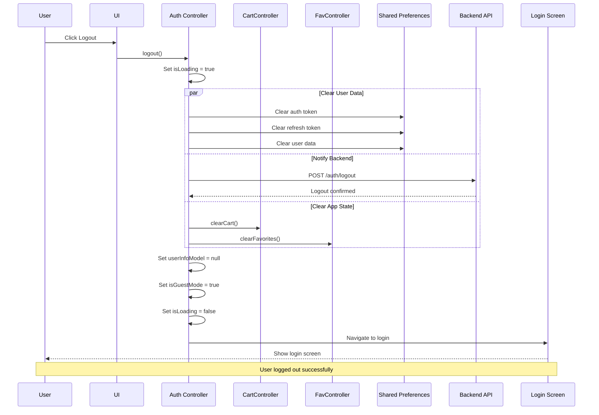
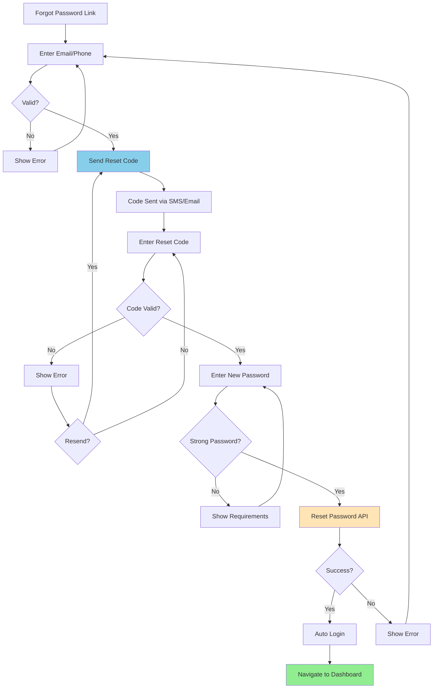
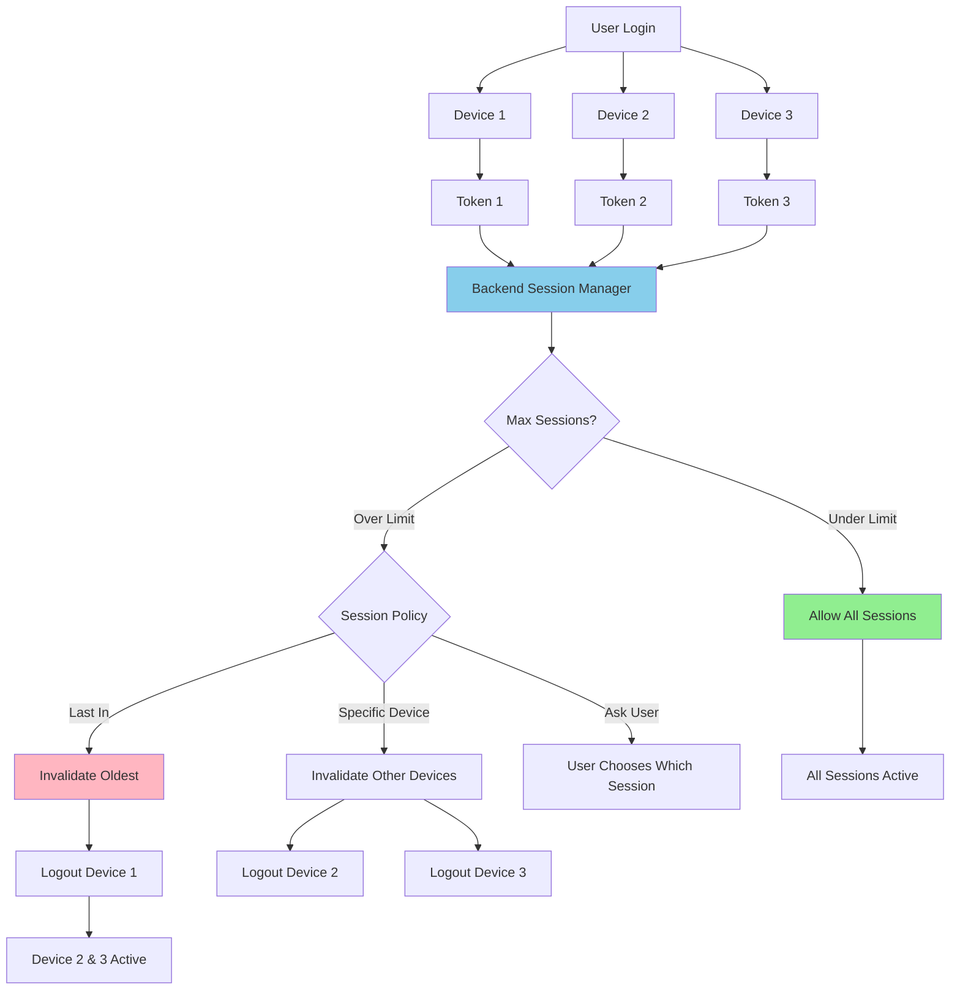

# Authentication Flow Diagrams

## Complete Authentication Flow

## Login Flow (Email/Phone)

## Registration Flow

## Social Login Flow

## Phone Verification Flow

## Session Management

## Logout Flow

## Password Reset Flow

## Multi-Device Session Handling

