# Features Architecture Diagrams

## Feature Module Flow Diagrams

### Authentication Flow

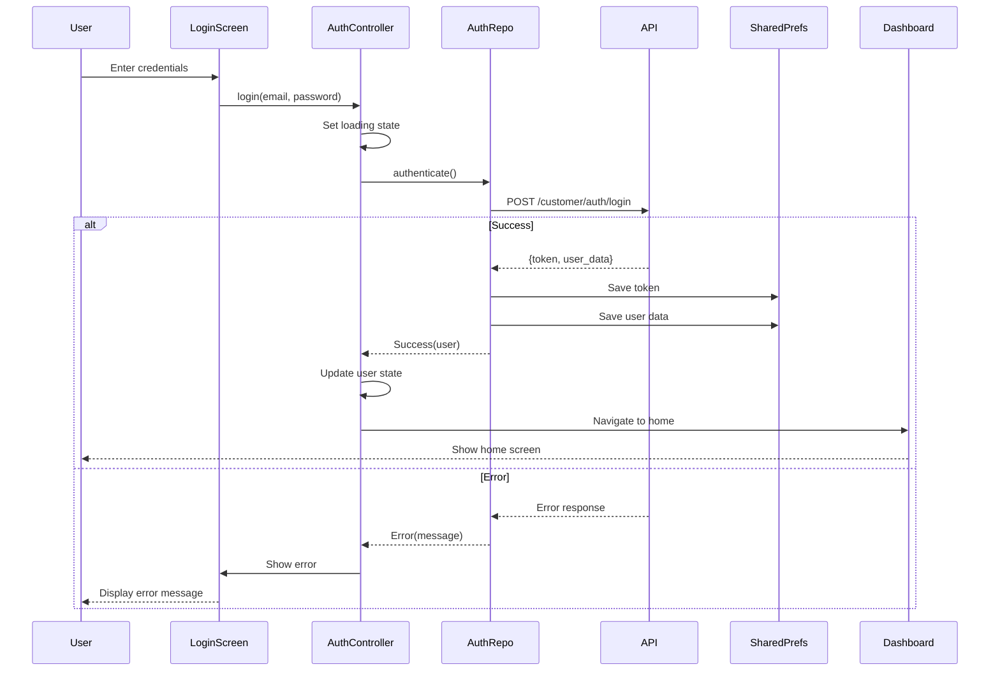

### Store & Item Browsing Flow

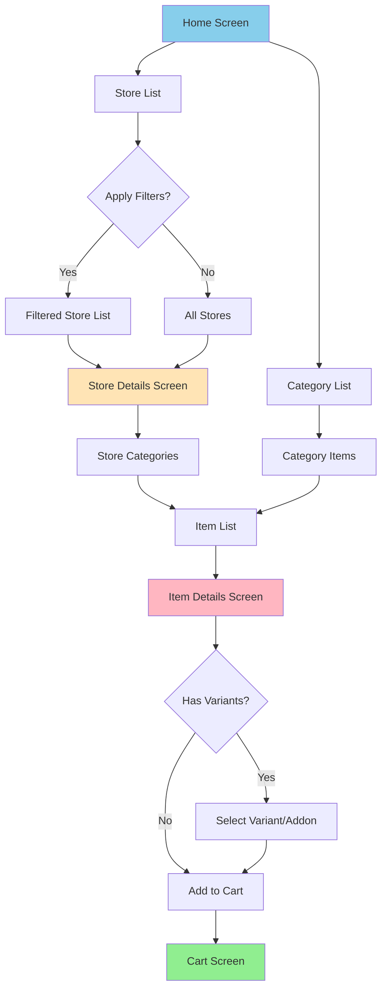

### Shopping Cart Flow

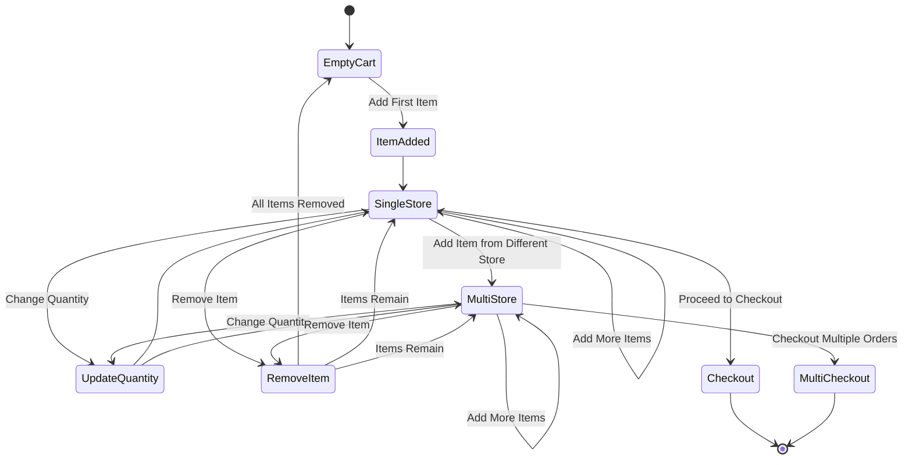

### Order Placement Flow

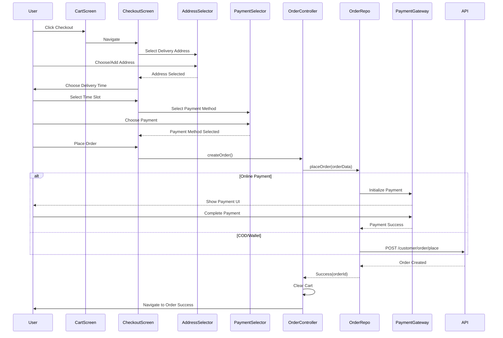

### Search Feature Flow

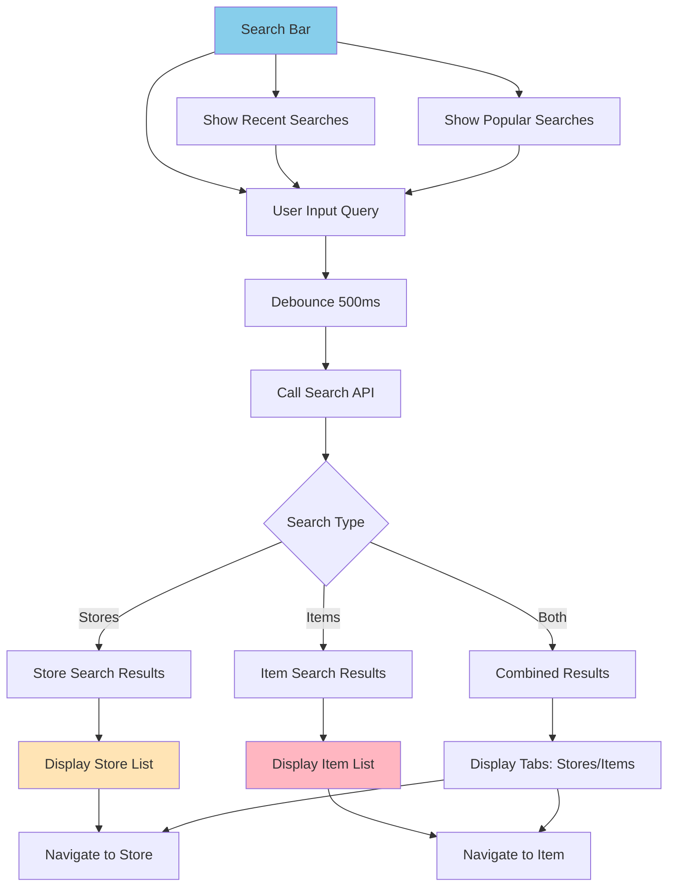

### Location & Address Management

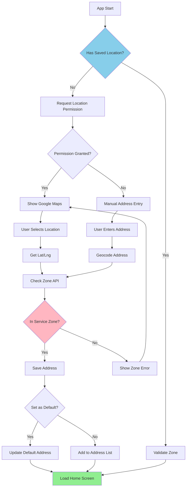

### Promotion & Offers System

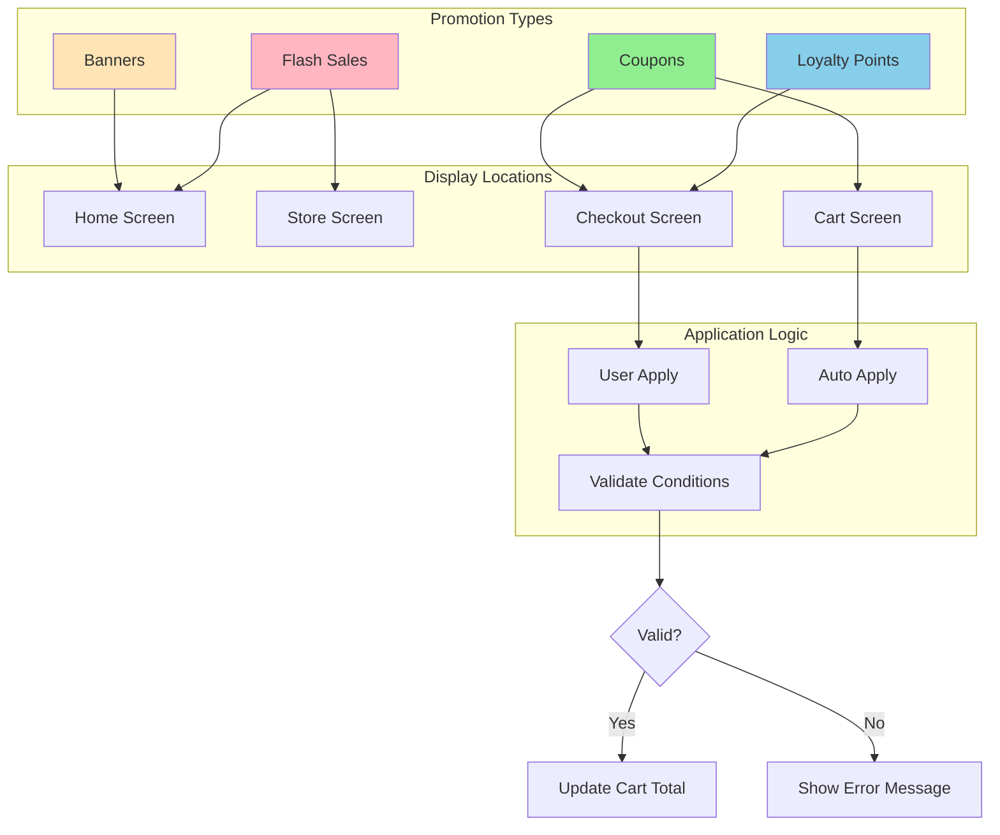

### Wallet System Flow

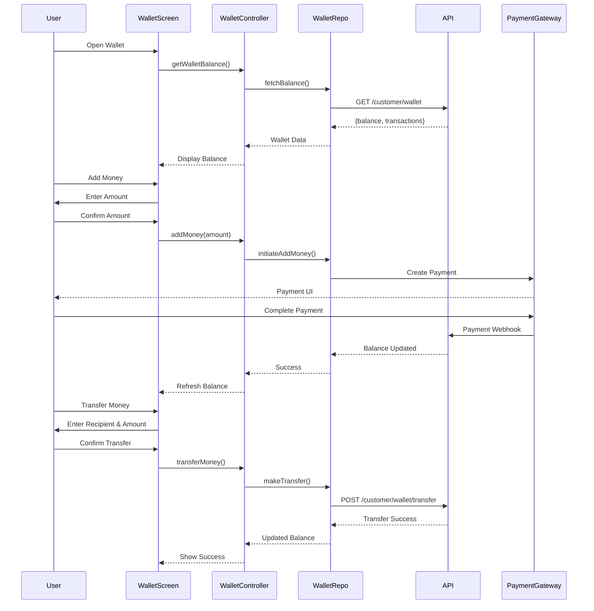

### Notification System Architecture

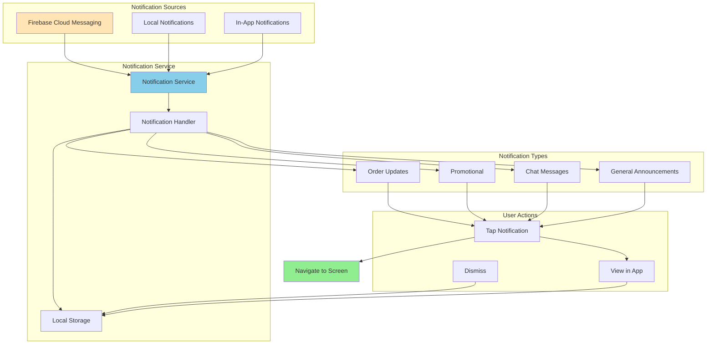

### Review & Rating System

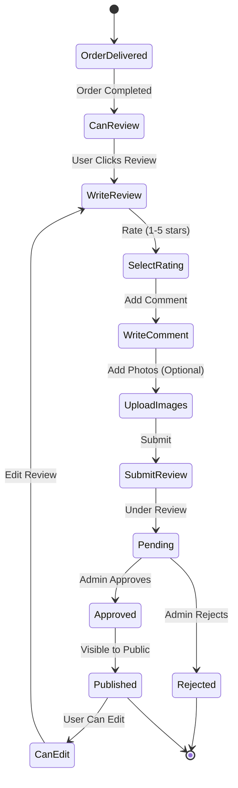

### Loyalty Points Flow

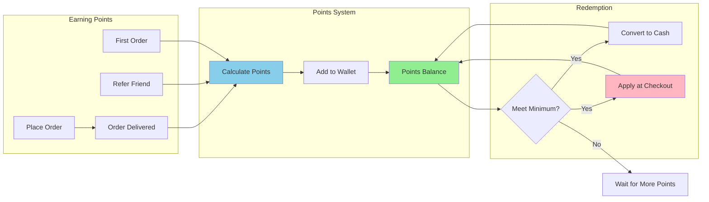

### Chat System Architecture

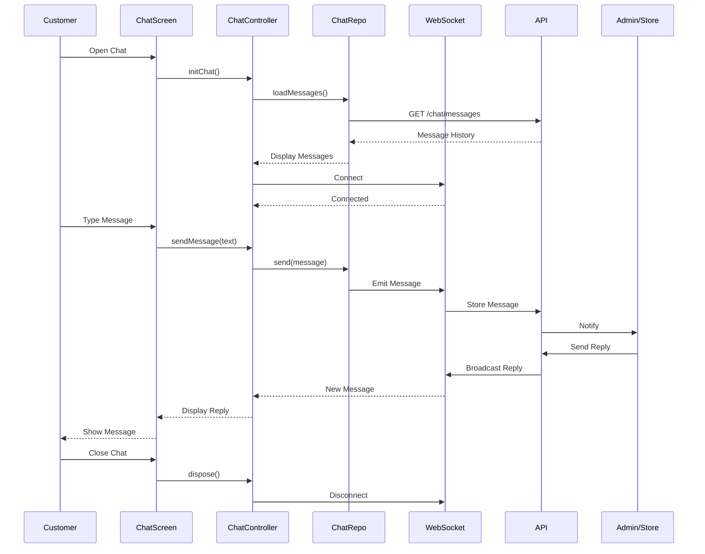

### Module Switching Flow

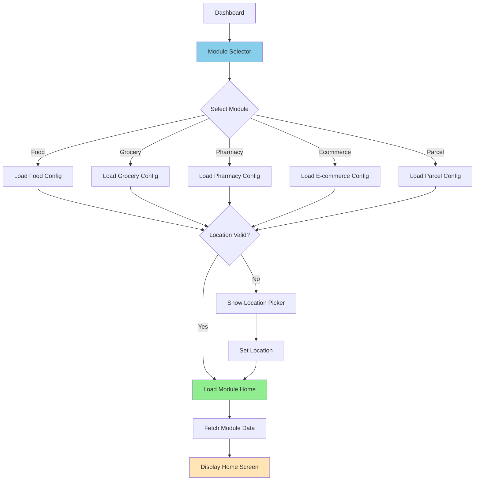

### Parcel Booking Flow

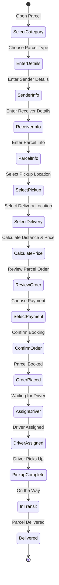
